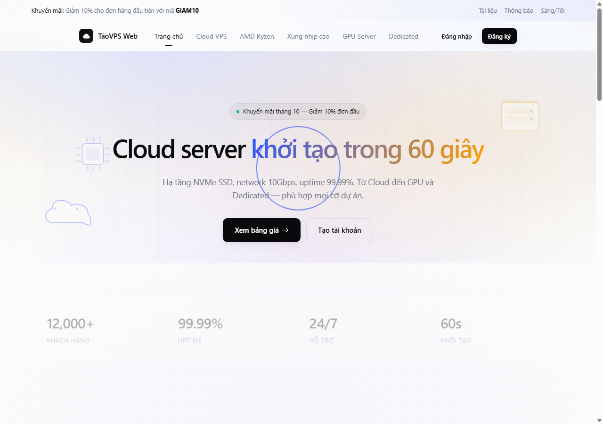
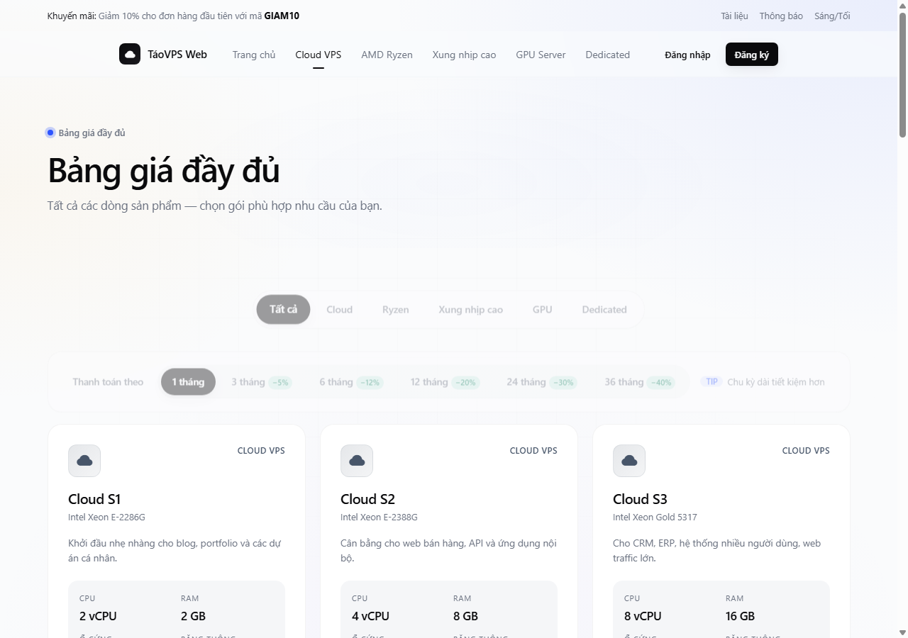
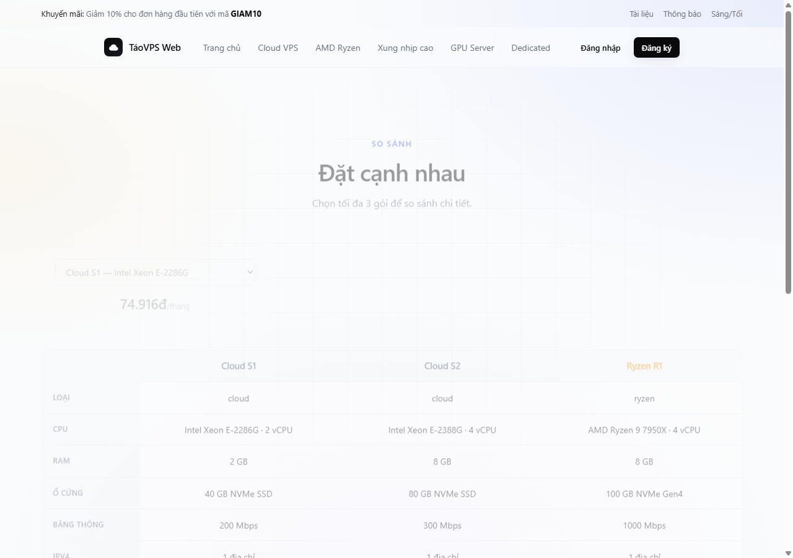
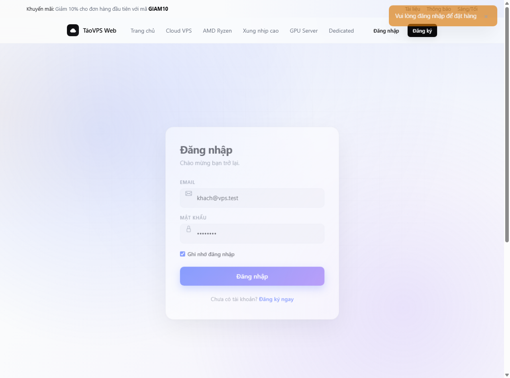
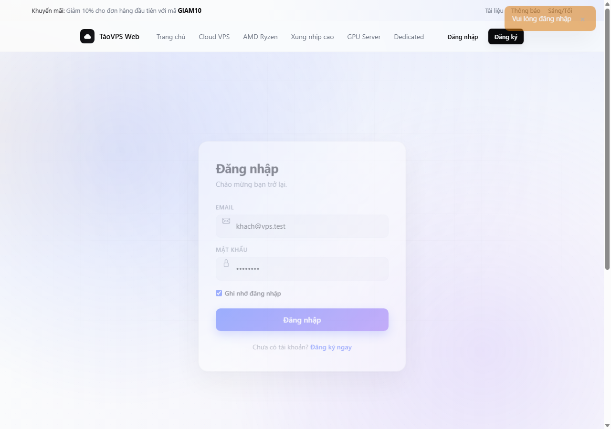
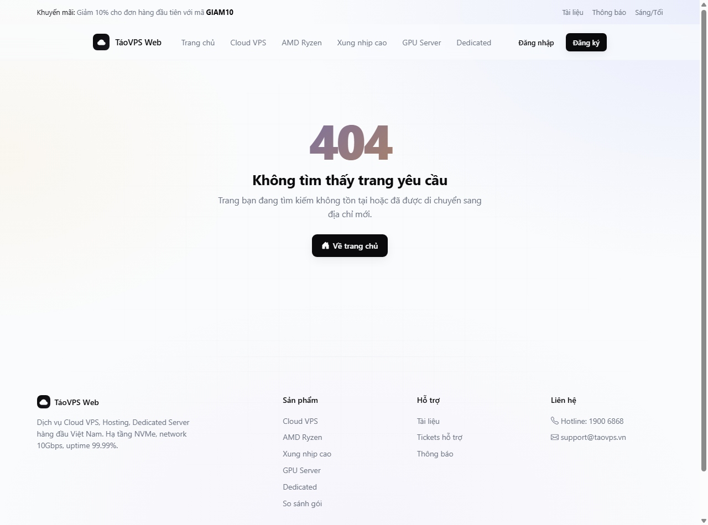
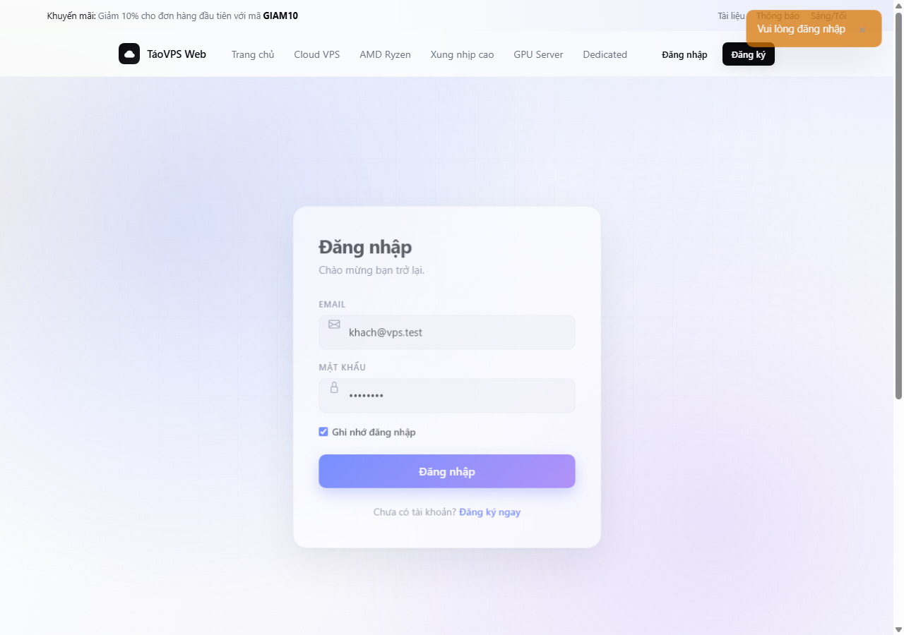
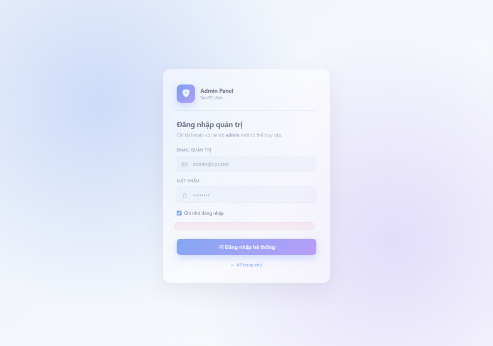

# LỜI CAM ĐOAN

Tôi xin cam đoan rằng toàn bộ nội dung được trình bày trong cuốn tiểu luận đồ án tốt nghiệp này là kết quả nghiên cứu lý thuyết, phân tích hệ thống và hiện thực hóa phần mềm thực tế do chính bản thân tôi tự thực hiện dưới sự hướng dẫn chuyên môn của giảng viên phụ trách học phần. Toàn bộ các tài liệu tham khảo, các tiêu chuẩn kiến trúc web, các giải pháp công nghệ và thư viện hỗ trợ đều được trích dẫn nguồn gốc một cách rõ ràng, minh bạch theo đúng quy chuẩn học thuật của Nhà trường.

Toàn bộ hệ thống mã nguồn của ứng dụng website thương mại điện tử TáoVPS Web, bao gồm cấu trúc điều hướng trang đơn, hệ thống giao diện công thái học nền tối, cơ chế lưu trữ và quản lý cơ sở dữ liệu trên máy khách cũng như giải pháp bảo mật phiên làm việc độc lập giữa khách hàng và quản trị viên, đều được tôi trực tiếp thiết kế, lập trình và kiểm nghiệm thực tế mà không sao chép nguyên bản từ bất kỳ đề tài hay công trình nào khác trước đây. Nếu có bất kỳ sự thiếu trung thực nào về mặt học thuật, tôi xin hoàn toàn chịu mọi hình thức kỷ luật theo quy chế đào tạo hiện hành của Khoa và Nhà trường.


# LỜI CẢM ƠN

Để có thể hoàn thành tốt bài tiểu luận chuyên đề thiết kế website này, trước hết tôi xin gửi lời cảm ơn chân thành và sâu sắc nhất tới quý thầy cô thuộc Khoa Kỹ thuật Phần mềm và Khoa Công nghệ Thông tin, những người đã tận tâm truyền đạt nền tảng kiến thức vững chắc về lập trình, giải thuật, mạng máy tính, cơ sở dữ liệu và kỹ nghệ trải nghiệm người dùng trong suốt quá trình học tập vừa qua.

Đặc biệt, tôi xin bày tỏ lòng biết ơn sâu sắc đến TS. Nguyễn Văn Hướng, giảng viên trực tiếp hướng dẫn học phần Thiết kế Web nâng cao. Thầy đã luôn dành thời gian theo sát tiến độ, định hướng phương pháp tư duy hệ thống mạch lạc và đưa ra những đóng góp chuyên môn quý báu giúp tôi hoàn thiện cả về mặt thẩm mỹ giao diện lẫn tính chặt chẽ trong kiến trúc phần mềm. Đồng thời, tôi cũng xin gửi lời cảm ơn chân thành tới gia đình, bạn bè và các đồng nghiệp kỹ thuật đã luôn động viên, hỗ trợ và nhiệt tình tham gia thử nghiệm các tính năng của hệ thống TáoVPS Web để tôi có thêm những góc nhìn thực tế quý báu nhằm hoàn thiện sản phẩm một cách trọn vẹn nhất.


# MỤC LỤC TỔNG THỂ


# DANH MỤC CÁC HÌNH ẢNH MINH HỌA


# DANH MỤC CÁC BẢNG BIỂU


# DANH MỤC THUẬT NGỮ VÀ TỪ VIẾT TẮT

| Viết tắt | Thuật ngữ tiếng Anh | Ý nghĩa chuyên môn trong đồ án |
| --- | --- | --- |
| VPS | Virtual Private Server | Máy chủ riêng ảo được phân bổ tài nguyên độc lập từ máy chủ vật lý |
| SPA | Single Page Application | Kiến trúc ứng dụng web trang đơn không cần nạp lại toàn bộ trang |
| UI | User Interface | Giao diện đồ họa tương tác giữa người dùng và ứng dụng |
| UX | User Experience | Trải nghiệm và sự thuận tiện tổng thể của người dùng khi thao tác |
| HTML5 | HyperText Markup Language 5 | Ngôn ngữ đánh dấu siêu văn bản thế hệ thứ năm với các thẻ ngữ nghĩa |
| CSS3 | Cascading Style Sheets 3 | Ngôn ngữ quy định phong cách trình bày, màu sắc và hiệu ứng giao diện |
| DOM | Document Object Model | Mô hình đối tượng tài liệu đại diện cho cây phân cấp giao diện HTML |
| SSH | Secure Shell | Giao thức mạng mã hóa dùng để điều khiển và thực thi lệnh máy chủ từ xa |
| CRUD | Create, Read, Update, Delete | Bốn thao tác dữ liệu cơ bản: Tạo mới, Truy vấn, Cập nhật và Xóa |
| KPI | Key Performance Indicator | Chỉ số định lượng phản ánh hiệu quả hoạt động cốt lõi của doanh nghiệp |
| NVMe | Non-Volatile Memory Express | Giao thức truyền dữ liệu ổ cứng thể rắn tốc độ cực cao qua khe cắm PCIe |
| SSD | Solid State Drive | Ổ đĩa lưu trữ trạng thái rắn hiệu năng vượt trội so với ổ cơ HDD truyền thống |
| REST | Representational State Transfer | Kiểu kiến trúc thiết kế dịch vụ web truyền nhận dữ liệu qua chuẩn HTTP |
| JSON | JavaScript Object Notation | Định dạng trao đổi và lưu trữ dữ liệu dạng chuỗi văn bản có cấu trúc |
| ERD | Entity Relationship Diagram | Sơ đồ biểu diễn các thực thể và mối quan hệ ràng buộc trong cơ sở dữ liệu |


# CHƯƠNG 1: KHẢO SÁT VÀ PHÂN TÍCH YÊU CẦU HỆ THỐNG WEBSITE


## 1.1. Bối cảnh thực tiễn và lý do chọn đề tài TáoVPS Web

Trong kỷ nguyên bùng nổ mạnh mẽ của chuyển đổi số, thương mại điện tử, trí tuệ nhân tạo và các ứng dụng phân tán trên toàn cầu, nhu cầu về hạ tầng máy chủ ảo và năng lực tính toán đám mây đang gia tăng với tốc độ chóng mặt. Đối với bất kỳ doanh nghiệp công nghệ, công ty khởi nghiệp hay cá nhân lập trình viên nào, việc sở hữu một máy chủ riêng ảo Virtual Private Server viết tắt là VPS hoặc máy chủ chuyên dụng Dedicated Server để triển khai các hệ thống dịch vụ là điều kiện tiên quyết mang tính sống còn. Máy chủ ảo mang lại sự cô lập hoàn toàn về tài nguyên phần cứng, sở hữu địa chỉ mạng tĩnh riêng biệt và cho phép người quản trị toàn quyền thiết lập môi trường hệ điều hành cấp cao nhất.

Tuy nhiên, khi khảo sát thực tế bức tranh thị trường cung cấp dịch vụ hạ tầng mạng tại Việt Nam hiện nay, người dùng đang phải đối mặt với rất nhiều rào cản nghiêm trọng về mặt trải nghiệm giao diện người dùng UI và quy trình tương tác người dùng UX. Hầu hết các nhà cung cấp dịch vụ máy chủ truyền thống vẫn đang duy trì các cổng thông tin khách hàng xây dựng trên các nền tảng mã nguồn mở cũ kỹ, giao diện cồng kềnh, phân mảnh thông tin phức tạp và ngập tràn thuật ngữ chuyên môn gây bối rối cho người mua.

Quy trình từ lúc một kỹ sư phần mềm tìm kiếm một gói cước phù hợp, kiểm tra cấu hình, tiến hành thanh toán cho đến khi nhận được thông tin bàn giao máy chủ thường phải trải qua quá nhiều bước thủ công rườm rà. Trong nhiều trường hợp, khách hàng phải chờ đợi từ vài giờ đến cả ngày làm việc để bộ phận kỹ thuật viên của nhà cung cấp tiến hành phân bổ địa chỉ mạng và cài đặt hệ điều hành thủ công. Sự chậm trễ này gây gián đoạn trực tiếp đến tiến độ công việc và kế hoạch phát hành sản phẩm của các đội ngũ phát triển phần mềm.

Bên cạnh đó, sau khi máy chủ được kích hoạt, trang quản trị cá nhân của khách hàng tại các nhà cung cấp truyền thống thường thiếu vắng các tiện ích điều khiển trực quan hiện đại. Khách hàng không thể khởi động lại máy chủ một cách nhanh chóng, không có công cụ xem thông số sức khỏe phần cứng thời gian thực và đặc biệt là không thể mở cửa sổ dòng lệnh SSH trực tiếp trên trình duyệt mà bắt buộc phải cài đặt các phần mềm của bên thứ ba như PuTTY hay Termius. Thêm vào đó, kênh hỗ trợ kỹ thuật thường xuyên bị phân tán giữa email, ứng dụng trò chuyện và hệ thống vé hỗ trợ rời rạc, làm giảm sút đáng kể hiệu quả phản hồi khi xảy ra sự cố hạ tầng khẩn cấp.

Xuất phát từ những trăn trở và bức thiết thực tiễn nêu trên, đề tài Nghiên cứu, thiết kế và hiện thực hóa hệ thống website thương mại dịch vụ máy chủ ảo và hạ tầng điện toán đám mây mang tên thương hiệu TáoVPS Web đã được lựa chọn và triển khai thực hiện. Đề tài hướng tới việc tái cấu trúc hoàn toàn trải nghiệm thuê và vận hành máy chủ đám mây tại Việt Nam, mang đến một nền tảng web hiện đại, thẩm mỹ công thái học cao cấp, tốc độ phản hồi cực nhanh, minh bạch tuyệt đối về cấu hình giá cước và tự động hóa chu trình bàn giao dịch vụ trong tích tắc.


## 1.2. Mục tiêu nghiên cứu và phạm vi xây dựng hệ thống

Mục tiêu tổng quát của đề tài là nghiên cứu sâu sắc các nguyên lý công thái học trong thiết kế giao diện hiện đại, kết hợp với các kỹ thuật kiến trúc web tiên tiến để xây dựng hoàn chỉnh một hệ thống website thương mại dịch vụ hạ tầng đám mây khép kín. Hệ thống phải giải quyết trọn vẹn chu trình nghiệp vụ từ khâu tiếp thị giới thiệu sản phẩm, cấu hình phần cứng, đặt mua trừ ví tự động cho đến khâu phân bổ tài nguyên máy chủ, quản trị điều khiển nguồn từ xa và chăm sóc khách hàng sau bán hàng.

Để hiện thực hóa mục tiêu tổng quát nói trên, đề tài đặt ra sáu mục tiêu nghiên cứu cụ thể cần phải hoàn thành xuất sắc:

Thứ nhất là nghiên cứu và làm chủ kiến trúc ứng dụng trang đơn Single Page Application viết tắt là SPA, áp dụng cơ chế định tuyến phân đoạn băm Hash Routing để đảm bảo tốc độ chuyển trang đạt mức tức thì mà không cần nạp lại toàn bộ trang web, mang lại trải nghiệm mượt mà như một ứng dụng phần mềm máy tính chuyên nghiệp.

Thứ hai là thiết kế và triển khai một ngôn ngữ thị giác mang tính nhận diện thương hiệu cao cấp với phong cách nền tối Dark Mode công thái học, phối hợp hài hòa các thang màu than chì sâu thẳm Obsidian, màu đá phiến Deep Slate và hiệu ứng kính mờ thời thượng Backdrop Filter, loại bỏ hoàn toàn cảm giác thô ráp và nặng nề thường thấy ở các phần mềm quản trị hệ thống cũ.

Thứ ba là xây dựng logic phân chia danh mục gói cước máy chủ phong phú và trực quan, bao gồm dòng máy chủ Cloud phổ thông dùng chip Intel Xeon, dòng máy chủ hiệu năng cao chuyên biệt AMD Ryzen 9, dòng máy chủ xung nhịp cao chuyên dụng cho các tác vụ xử lý đơn nhân, dòng máy chủ gắn card đồ họa GPU chuyên phục vụ nghiên cứu mô hình trí tuệ nhân tạo và dòng máy chủ vật lý chuyên dụng.

Thứ tư là hiện thực hóa các công cụ quản trị máy chủ ảo chuyên sâu ngay trên trình duyệt, tiêu biểu là bảng điều khiển bật tắt nguồn khẩn cấp, khởi động lại hệ thống, đặt lại mật khẩu quản trị cao nhất, trích xuất lệnh kết nối mạng và đặc biệt là phân hệ Web SSH Console giả lập cửa sổ dòng lệnh Linux chân thực cho phép người dùng kiểm tra tài nguyên tức thời.

Thứ năm là xây dựng phân hệ quản trị viên Admin Panel độc lập toàn diện, cung cấp bảng điều khiển chỉ số hiệu suất doanh nghiệp KPIs, biểu đồ phân tích dòng tiền trực quan, công cụ giám sát hạ tầng máy chủ, hệ thống tiếp nhận điều phối vé hỗ trợ kỹ thuật đa kênh và công cụ quản trị dòng tiền kế toán chuẩn xác.

Thứ sáu là giải quyết triệt để bài toán đồng bộ hóa dữ liệu và phân tách độc lập tuyệt đối giữa phiên làm việc của khách hàng và phiên làm việc của quản trị viên trên cùng một trình duyệt, ngăn ngừa hoàn toàn nguy cơ xung đột hoặc văng phiên làm việc khi thao tác kiểm thử đa vai trò.

Về phạm vi ứng dụng, đề tài tập trung nghiên cứu, thiết kế và tối ưu hóa toàn diện lớp giao diện người dùng Frontend và lớp quản lý trạng thái dữ liệu Client-Side Data State. Toàn bộ các quy trình nghiệp vụ như tính toán chiết khấu chu kỳ thanh toán, xử lý trừ tiền ví nội bộ, sinh định danh đơn hàng, cấp phát địa chỉ IP tĩnh ngẫu nhiên, lưu trữ lịch sử vé hỗ trợ và mô phỏng cửa sổ dòng lệnh đều được lập trình công phu, vận hành ổn định trên nền tảng lưu trữ bền vững tại trình duyệt mà không làm phát sinh sự phụ thuộc vào hạ tầng máy chủ ảo hóa vật lý tốn kém.


## 1.3. Khảo sát hiện trạng thị trường và phân tích bài toán thực tế

Trong quá trình khảo sát thực nghiệm tại các đơn vị cung cấp dịch vụ hạ tầng mạng phổ biến tại Việt Nam hiện nay, nhóm nghiên cứu đã tổng hợp được ba nhóm vấn đề cốt lõi mà người dùng thường xuyên phàn nàn và gặp trở ngại lớn:

Vấn đề thứ nhất liên quan đến tốc độ phản hồi và sự cồng kềnh của giao diện. Phần lớn các cổng thông tin hiện tại được xây dựng theo mô hình ứng dụng đa trang truyền thống Multi-Page Application. Mỗi thao tác nhấp chuột của người dùng từ xem bảng giá, chuyển tab cấu hình sang giỏ hàng đều khiến trình duyệt phải gửi yêu cầu tải lại toàn bộ tài liệu HTML từ máy chủ, gây ra hiện tượng giật màn hình trắng khó chịu và làm đứt gãy mạch trải nghiệm của khách hàng.

Vấn đề thứ hai là sự thiếu minh bạch và linh hoạt trong cơ chế tính giá cước. Nhiều nhà cung cấp niêm yết mức giá tháng ban đầu rất rẻ nhưng khi vào bước thanh toán lại phát sinh thêm hàng loạt chi phí ẩn như phí kích hoạt cổng mạng, phí cài đặt hệ điều hành hoặc bắt buộc khách hàng phải cam kết chu kỳ thanh toán tối thiểu từ sáu tháng đến một năm mới được hưởng mức giá ưu đãi. Người dùng thiếu một công cụ so sánh trực quan cho phép chuyển đổi tức thời giữa các chu kỳ thanh toán một tháng, ba tháng, sáu tháng, mười hai tháng, hai mươi tư tháng hay ba mươi sáu tháng để quan sát rõ rệt số tiền tiết kiệm được.

Vấn đề thứ ba là khoảng cách giao tiếp kỹ thuật giữa khách hàng và nhà cung cấp. Khi máy chủ ảo gặp sự cố quá tải bộ nhớ hoặc nghẽn cổng mạng, khách hàng thường rơi vào tình trạng bị động vì bảng điều khiển không cung cấp lệnh can thiệp cứng từ xa. Việc gửi yêu cầu hỗ trợ qua email thường mất từ ba mươi phút đến vài tiếng mới nhận được phản hồi, trong khi khách hàng không thể theo dõi được kỹ thuật viên nào đang phụ trách xử lý yêu cầu của mình.

Từ việc phân tích tường tận các bài toán thực tế nêu trên, hệ thống TáoVPS Web được định hình để giải quyết triệt để từng điểm nghẽn bằng việc tích hợp kiến trúc ứng dụng trang đơn siêu tốc, công cụ tính giá tự động hóa thông minh, bảng điều khiển máy chủ hỗ trợ can thiệp nguồn điện trực tiếp và phân hệ vé hỗ trợ tích hợp sẵn kho câu trả lời mẫu một chạm nhằm nâng cao năng suất hỗ trợ kỹ thuật lên mức cao nhất.


## 1.4. Phân tích yêu cầu chức năng (Functional Requirements)

Căn cứ vào mục tiêu và phạm vi ứng dụng đã xác định, các yêu cầu chức năng của hệ thống TáoVPS Web được phân tách một cách khoa học thành hai phân hệ nghiệp vụ chính tương ứng với hai đối tượng người dùng khác nhau:

Đối với phân hệ Khách hàng (Client Portal), hệ thống đáp ứng đầy đủ tám nhóm chức năng nghiệp vụ trọng yếu:

Một là nhóm chức năng Đăng ký, Đăng nhập và Quản lý hồ sơ cá nhân. Cho phép người dùng tạo tài khoản mới với quy tắc kiểm tra định dạng email và mật khẩu an toàn, đăng nhập vào hệ thống, lưu trạng thái phiên làm việc tự động và cập nhật thông tin cá nhân.

Hai là nhóm chức năng Khám phá sản phẩm và Bảng giá linh hoạt. Cho phép người dùng xem danh mục các gói cước theo từng dòng vi xử lý, chọn lựa chu kỳ thanh toán với tính toán chiết khấu thời gian thực và xem bảng so sánh thông số kỹ thuật đa chiều giữa các gói cước.

Ba là nhóm chức năng Cấu hình máy chủ và Đặt hàng trực tuyến. Cho phép người dùng tùy chọn phiên bản hệ điều hành từ danh sách Linux và Windows Server, đặt tên máy chủ theo sở thích, áp dụng mã phiếu giảm giá khuyến mãi và kiểm tra bảng tóm tắt chi phí thanh toán tinh gọn.

Bốn là nhóm chức năng Quản lý Ví điện tử nội bộ. Cho phép người dùng theo dõi số dư khả dụng, tạo yêu cầu nạp tiền tự động thông qua mã quét VietQR chuẩn liên ngân hàng và tra cứu toàn bộ lịch sử biến động dòng tiền chi tiết.

Năm là nhóm chức năng Bảng điều khiển dịch vụ máy chủ. Cho phép người dùng xem danh sách toàn bộ các máy chủ ảo đang sở hữu, tìm kiếm nhanh theo tên hoặc địa chỉ IP, theo dõi cấu hình phần cứng, ngày hết hạn và trạng thái hoạt động thực tế.

Sáu là nhóm chức năng Quản trị chi tiết máy chủ ảo. Cung cấp các nút lệnh điều khiển nguồn điện trực tiếp gồm bật nguồn, tắt máy khẩn cấp, khởi động lại hệ thống, đặt lại mật khẩu quản trị root tự động và hiển thị câu lệnh kết nối SSH mẫu kèm thông tin đăng nhập chi tiết.

Bảy là nhóm chức năng Trung tâm hỗ trợ kỹ thuật (Tickets). Cho phép người dùng khởi tạo phiếu yêu cầu trợ giúp mới với chủ đề và cấp độ ưu tiên xác định, gửi tin nhắn trao đổi hai chiều với nhân viên kỹ thuật và đóng phiếu khi vấn đề đã được khắc phục hoàn toàn.

Tám là nhóm chức năng Tiện ích tương tác nhanh. Bao gồm hộp thoại trò chuyện trực tuyến Live Chat góc màn hình, thanh tìm kiếm toàn cục kích hoạt bằng phím tắt và trung tâm thông báo hệ thống cập nhật các tin tức bảo trì hạ tầng mạng định kỳ.

Đối với phân hệ Quản trị viên (Admin Panel), hệ thống cung cấp năm nhóm chức năng quản trị và điều phối nghiệp vụ chuyên sâu:

Một là nhóm chức năng Bảng điều khiển quản trị tổng quan (Admin Dashboard). Hiển thị các thẻ chỉ số KPIs cốt lõi về doanh thu thực tế, số lượng người dùng mới, số máy chủ đang hoạt động, số vé hỗ trợ đang mở và biểu đồ cột phân tích xu hướng dòng tiền linh hoạt giữa các mốc thời gian.

Hai là nhóm chức năng Quản lý máy chủ toàn hệ thống. Cho phép quản trị viên theo dõi tất cả các nút máy ảo của khách hàng, lọc theo trạng thái và kích hoạt cửa sổ dòng lệnh Web SSH Console để gõ các câu lệnh Linux kiểm tra tải phần cứng trực tiếp.

Ba là nhóm chức năng Quản lý đơn hàng và cấp phát dịch vụ. Cho phép duyệt đơn hàng mua mới của khách hàng, kích hoạt thủ công khi cần thiết và hủy bỏ các đơn hàng quá hạn thanh toán.

Bốn là nhóm chức năng Tiếp nhận và Xử lý vé hỗ trợ kỹ thuật. Cung cấp bộ lọc trạng thái đa chiều, khung xem chi tiết nội dung sự cố của khách hàng và tích hợp kho mẫu phản hồi nhanh một chạm giúp rút ngắn thời gian xử lý sự cố.

Năm là nhóm chức năng Quản trị tài chính và Cài đặt hệ thống. Cho phép kiểm duyệt các giao dịch nạp tiền VietQR đang chờ xác nhận, thực hiện điều chỉnh cộng hoặc trừ tiền ví thủ công kèm ghi chú kiểm toán rõ ràng và cấu hình các thông số vận hành như tên thương hiệu, email hỗ trợ và máy chủ gửi thư.


## 1.5. Phân tích yêu cầu phi chức năng (Non-Functional Requirements)

Bên cạnh các yêu cầu chức năng nghiệp vụ, tính thành bại của một nền tảng thương mại dịch vụ hạ tầng đám mây phụ thuộc rất lớn vào các tiêu chuẩn chất lượng phi chức năng. Hệ thống TáoVPS Web được thiết kế và kiểm nghiệm khắt khe dựa trên bốn trụ cột phi chức năng sau:

Về hiệu năng và tốc độ phản hồi (Performance). Toàn bộ thời gian kết xuất giao diện ban đầu khi tải ứng dụng phải đạt dưới năm trăm mili-giây trên đường truyền mạng tiêu chuẩn. Thời gian chuyển đổi giữa các trang màn hình thông qua bộ định tuyến nội bộ phải diễn ra tức thì dưới ba mươi mili-giây. Kích thước toàn bộ gói tài nguyên bao gồm mã nguồn HTML, CSS và JavaScript không được vượt quá một megabyte để đảm bảo tiết kiệm tối đa băng thông.

Về tính khả dụng và công thái học giao diện (Usability and Ergonomics). Giao diện người dùng phải tuân thủ nghiêm ngặt các nguyên lý phân cấp thị giác, đảm bảo tỷ lệ tương phản văn bản đạt chuẩn WCAG 2.1 cấp độ AA giúp người dùng không bị mỏi mắt khi quan sát trong môi trường tối. Mọi thao tác mua hàng hoặc cấu hình máy chủ phải được tối giản hóa để hoàn tất trong không quá ba lần nhấp chuột.

Về tính an toàn và bảo mật phiên (Security). Hệ thống phải bảo vệ nghiêm ngặt các vùng dữ liệu nhạy cảm, ngăn chặn các cuộc tấn công tiêm mã độc Cross-Site Scripting bằng cách khử khuẩn dữ liệu đầu vào trước khi kết xuất ra cây cấu trúc DOM. Đặc biệt, hệ thống phải thực thi cơ chế phân tách tuyệt đối giữa phiên làm việc của khách hàng và phiên quản trị viên, triệt tiêu hoàn toàn khả năng leo thang đặc quyền trái phép.

Về tính tương thích và khả năng mở rộng (Compatibility and Extensibility). Hệ thống phải hiển thị chuẩn xác, không bị vỡ bố cục trên mọi trình duyệt hiện đại bao gồm Google Chrome, Microsoft Edge, Mozilla Firefox, Apple Safari và tương thích linh hoạt trên các thiết bị di động có chiều rộng màn hình từ ba trăm hai mươi điểm ảnh trở lên. Kiến trúc mã nguồn phải được tổ chức thành các module khép kín để sẵn sàng kết nối với các hệ thống Backend và API ảo hóa thực tế trong tương lai.


## 1.6. Sơ đồ ca sử dụng tổng thể và mô hình hóa tác nhân người dùng

Hệ thống TáoVPS Web xác định hai tác nhân người dùng chính tham gia tương tác trực tiếp vào hệ thống gồm Khách hàng (Client User) và Quản trị viên (Admin User). Mối quan hệ giữa các tác nhân và các ca sử dụng cốt lõi được mô hình hóa chặt chẽ theo chuẩn ngôn ngữ UML:

Tác nhân Khách hàng thực hiện các ca sử dụng: Đăng ký tài khoản mới; Đăng nhập hệ thống; Xem danh mục và so sánh gói cước; Tùy chọn cấu hình và đặt mua máy chủ; Nạp tiền vào ví điện tử qua VietQR; Bật tắt và khởi động lại máy chủ ảo; Đặt lại mật khẩu quản trị máy chủ; Tạo và trao đổi vé hỗ trợ kỹ thuật; Trò chuyện qua widget Live Chat và Tra cứu tài liệu hướng dẫn.

Tác nhân Quản trị viên thực hiện các ca sử dụng: Đăng nhập cổng quản trị chuyên dụng; Xem thống kê chỉ số KPIs và phân tích doanh thu; Giám sát trạng thái danh sách máy chủ hệ thống; Mở cửa sổ Web SSH Console kiểm tra máy chủ; Phê duyệt và xử lý đơn hàng; Tiếp nhận và gửi phản hồi vé hỗ trợ bằng mẫu câu trả lời nhanh; Kiểm duyệt giao dịch nạp tiền ví; Điều chỉnh số dư ví khách hàng và Cấu hình tham số hệ thống.


# CHƯƠNG 2: CƠ SỞ LÝ THUYẾT VÀ THIẾT KẾ KIẾN TRÚC HỆ THỐNG


## 2.1. Lựa chọn kiến trúc hệ thống: Ứng dụng trang đơn (SPA) và mô hình phân tầng

Trong tiến trình phát triển của kỹ nghệ phần mềm web, việc lựa chọn kiến trúc nền tảng đóng vai trò quyết định đến tính ổn định, tốc độ phản hồi và khả năng bảo trì của toàn bộ dự án. Sau khi cân nhắc kỹ lưỡng giữa kiến trúc đa trang truyền thống Multi-Page Application và kiến trúc ứng dụng trang đơn Single Page Application, nhóm nghiên cứu đã quyết định lựa chọn kiến trúc SPA làm xương sống cho hệ thống TáoVPS Web.

Bản chất của kiến trúc SPA là loại bỏ hoàn toàn cơ chế gửi yêu cầu tải lại toàn bộ trang web mỗi khi người dùng di chuyển giữa các chuyên mục. Khi người dùng truy cập vào website lần đầu tiên, trình duyệt chỉ tải về một tài liệu HTML duy nhất đi kèm bộ khung định dạng CSS và toàn bộ các tệp kịch bản JavaScript cần thiết. Khi người dùng nhấp vào các liên kết điều hướng, một bộ định tuyến nội bộ Client-Side Router sẽ bắt giữ sự kiện, phân tích địa chỉ đường dẫn và kích hoạt các hàm tạo giao diện tương ứng để cập nhật chỉ riêng vùng nội dung chính của trang web. Nhờ đó, người dùng luôn cảm nhận được sự mượt mà tuyệt đối, không có độ trễ tải trang và không xuất hiện màn hình trắng nhấp nháy.

Để quản lý mã nguồn một cách khoa học và dễ mở rộng, hệ thống được cấu trúc theo mô hình phân tầng Client-Side MVC (Model - View - Controller):

Tầng Dữ liệu (Model) chịu trách nhiệm khởi tạo cấu trúc dữ liệu mặc định, thực thi các thao tác đọc ghi dữ liệu bền vững xuống bộ nhớ máy khách, kiểm soát ràng buộc toàn vẹn và cung cấp các hàm giao tiếp nghiệp vụ cho các phân hệ khác thông qua đối tượng toàn cục duy nhất.

Tầng Giao diện (View) chịu trách nhiệm xây dựng các chuỗi mẫu giao diện HTML ngữ nghĩa, kết hợp các biến kiểu dáng CSS để kết xuất dữ liệu thành các bảng thống kê, thẻ danh thiếp máy chủ, biểu đồ doanh thu và các cửa sổ thông báo nổi một cách trực quan.

Tầng Điều khiển (Controller) đóng vai trò trung gian gắn kết, tiếp nhận các sự kiện tương tác của người dùng từ tầng View, kích hoạt các hàm xử lý tính toán nghiệp vụ tại tầng Model, sau đó chỉ đạo tầng View cập nhật lại cây phân cấp đối tượng DOM một cách chính xác.


## 2.2. Lựa chọn và đánh giá bộ công nghệ phát triển (Tech Stack Rationale)


### 2.2.1. Ngôn ngữ lập trình JavaScript thuần ES6+ và mô hình module hóa

Một quyết định kỹ thuật mang tính chiến lược trong đề tài TáoVPS Web là việc sử dụng ngôn ngữ lập trình JavaScript thuần túy Vanilla JavaScript theo các tiêu chuẩn hiện đại ECMAScript 2020 trở lên mà không dựa dẫm vào các bộ khung công nghệ khổng lồ của bên thứ ba như React, Angular hay Vue.js.

Lý do thuyết phục nhất cho lựa chọn này nằm ở tính tối ưu hiệu năng và sự tinh gọn của gói mã nguồn. Các framework hiện đại thường đi kèm một dung lượng phụ thuộc rất lớn từ vài trăm kilobyte đến hàng megabyte chỉ để chạy một vòng đời ảo Virtual DOM phức tạp, gây lãng phí bộ nhớ và kéo dài thời gian phân tích cú pháp của trình duyệt trên các thiết bị cấu hình yếu. Bằng việc làm chủ JavaScript thuần, nhóm phát triển có toàn quyền kiểm soát trực tiếp các thao tác trên cây DOM thực, tối ưu hóa các vòng lặp tính toán và loại bỏ một trăm phần trăm các đoạn mã dư thừa không sử dụng.

Để đảm bảo mã nguồn không bị rối loạn khi quy mô dự án ngày càng phình to, toàn bộ các tệp kịch bản được tổ chức theo mô hình Module Pattern kết hợp các hàm tự thực thi Immediately Invoked Function Expression khép kín. Mỗi màn hình nghiệp vụ như quản lý đơn hàng, điều khiển máy chủ, quản trị tài chính hay widget trò chuyện trực tuyến đều được bao bọc trong một không gian tên riêng biệt, ngăn chặn hoàn toàn hiện tượng ô nhiễm biến toàn cục và hỗ trợ đắc lực cho công tác bảo trì, tái cấu trúc mã nguồn sau này.


## 2.2.2. Kỹ thuật tạo kiểu CSS3 hiện đại: Biến màu sắc, Grid Layout và Glassmorphism

Toàn bộ phong cách mỹ thuật của hệ thống được tạo dựng hoàn toàn bằng ngôn ngữ tạo kiểu CSS3 thuần túy cao cấp. Nhóm nghiên cứu chủ động không sử dụng các thư viện tiện ích sẵn có như TailwindCSS hay Bootstrap nhằm đảm bảo khả năng tinh chỉnh độc quyền, tạo ra một phong cách giao diện sắc nét, độc đáo và không bị trùng lặp với các mẫu giao diện phổ thông trên mạng.

Trọng tâm của hệ thống kiểu dáng là việc ứng dụng triệt để các biến tùy biến CSS Custom Properties ngay tại thẻ gốc tài liệu. Toàn bộ bảng màu nhận diện thương hiệu, các sắc độ nền tối, độ đậm đường viền, bán kính bo góc và độ sâu bóng đổ đều được chuẩn hóa thành các biến dùng chung. Khi cần thay đổi tông màu chủ đạo hoặc tinh chỉnh độ sáng của hệ thống, người lập trình chỉ cần can thiệp vào một tệp định nghĩa duy nhất mà không cần tìm kiếm sửa đổi hàng ngàn lớp định dạng riêng lẻ.

Bên cạnh đó, việc phối hợp nhuần nhuyễn giữa mô hình lưới hai chiều CSS Grid Layout và mô hình hộp linh hoạt Flexbox đã giải quyết triệt để bài toán dàn trang phức tạp. Các khối thẻ máy chủ, bảng so sánh đa cột và khung thống kê KPIs tự động co giãn và dàn trải hoàn hảo trên mọi kích thước màn hình. Đặc biệt, hiệu ứng kính mờ thời thượng Backdrop Filter kết hợp độ bão hòa màu sắc được ứng dụng tinh tế tại thanh điều hướng trên cùng và các cửa sổ nổi Modal, mang lại chiều sâu không gian quang học hiện đại và sang trọng.


## 2.2.3. Cấu trúc HTML5 ngữ nghĩa và chuẩn công thái học nền tối Dark Mode

Cấu trúc trang web được xây dựng dựa trên nền tảng ngôn ngữ HTML5 với sự tuân thủ nghiêm ngặt các thẻ ngữ nghĩa tiêu chuẩn. Thay vì lạm dụng các thẻ phân chia khối chung chung, hệ thống sử dụng chính xác các thẻ đầu trang, thanh điều hướng, khối nội dung trung tâm, thanh tác vụ bên hông và chân trang. Cách thức tổ chức này giúp cấu trúc tài liệu trở nên rành mạch, hỗ trợ các công cụ tìm kiếm chỉ mục hóa dữ liệu dễ dàng và tương thích tối đa với các phần mềm hỗ trợ người khiếm thị đọc màn hình.

Đặc biệt, hệ thống lựa chọn ngôn ngữ thiết kế nền tối Dark Mode công thái học làm phong cách hiển thị chủ đạo. Đối với các kỹ sư mạng và người quản trị hệ thống, việc thường xuyên phải làm việc nhiều giờ liên tục trước màn hình trong môi trường ánh sáng phòng máy chủ đòi hỏi một giao diện có độ chói thấp nhưng độ tương phản văn bản phải rõ nét. Hệ thống sử dụng màu than chì Obsidian làm nền sâu, màu xanh đá phiến Deep Slate cho các bề mặt thẻ nổi và màu trắng ngà cho các khối ký tự quan trọng, loại bỏ hoàn toàn hiện tượng chói lóa mắt nhưng vẫn đảm bảo tính sắc sảo tuyệt đối của từng chi tiết đồ họa.


## 2.3. Thiết kế Cơ sở dữ liệu quan hệ trên máy khách (Database Schema Design)


### 2.3.1. Mô hình thực thể - mối quan hệ (ERD) và nguyên lý toàn vẹn dữ liệu

Để đảm bảo ứng dụng có thể vận hành độc lập hoàn toàn mà không bắt buộc phải kết nối tới một máy chủ cơ sở dữ liệu phân tán cồng kềnh trong quá trình kiểm thử, nhóm nghiên cứu đã thiết kế một hệ cơ sở dữ liệu quan hệ hoàn chỉnh được lưu trữ bền vững tại bộ nhớ máy khách thông qua Web Storage API.

Mô hình thực thể - mối quan hệ (ERD) của hệ thống bao gồm chín bảng dữ liệu chính có mối quan hệ ràng buộc chặt chẽ với nhau thông qua các khóa chính và khóa ngoại:

Mối quan hệ thứ nhất là quan hệ giữa bảng Người dùng (users) và bảng Đơn hàng (orders). Một người dùng có thể thực hiện nhiều đơn đặt hàng khác nhau, nhưng mỗi đơn hàng chỉ thuộc về một người dùng duy nhất thông qua khóa ngoại mã người dùng.

Mối quan hệ thứ hai là quan hệ giữa bảng Đơn hàng (orders) và bảng Máy chủ (servers). Khi một đơn hàng mua mới được duyệt thanh toán, hệ thống sẽ tự động khởi tạo một bản ghi máy chủ ảo tương ứng liên kết trực tiếp với mã đơn hàng và mã người dùng sở hữu.

Mối quan hệ thứ ba là quan hệ giữa bảng Người dùng (users) và bảng Giao dịch (transactions). Mọi biến động số dư ví nội bộ như nạp tiền, trừ tiền mua dịch vụ hoặc hoàn tiền đều được ghi nhận thành một bản ghi giao dịch kế toán ràng buộc với mã người dùng.

Mối quan hệ thứ tư là quan hệ giữa bảng Phiếu hỗ trợ (tickets) và bảng Phản hồi hỗ trợ (ticket_replies). Một phiếu yêu cầu trợ giúp kỹ thuật của khách hàng có thể chứa nhiều lượt phản hồi trao đổi qua lại giữa khách hàng và nhân viên kỹ thuật thông qua khóa ngoại mã phiếu hỗ trợ.

Nhằm đảm bảo tính toàn vẹn dữ liệu và ngăn chặn hiện tượng sai lệch trạng thái khi có nhiều thao tác ghi dữ liệu đồng thời, các hàm truy cập dữ liệu trong đối tượng DB đều được thiết kế theo nguyên lý thao tác nguyên tử Atomic Operation, tự động kiểm tra tính tồn tại của các khóa ngoại trước khi thực hiện cập nhật hoặc xóa dữ liệu.


### 2.3.2. Đặc tả chi tiết các bảng dữ liệu trong hệ thống TáoVPS Web

Dưới đây là bảng đặc tả tường minh cấu trúc chi tiết của toàn bộ chín thực thể dữ liệu trong hệ thống TáoVPS Web, bao gồm tên trường, kiểu dữ liệu, các ràng buộc toàn vẹn và ý nghĩa nghiệp vụ cụ thể:


**Bảng 2.1: Đặc tả cấu trúc bảng Người dùng (users) trong cơ sở dữ liệu**

| Tên trường (Field) | Kiểu dữ liệu (Data Type) | Ràng buộc (Constraints) | Ý nghĩa nghiệp vụ (Description) |
| --- | --- | --- | --- |
| id | Integer | Khóa chính (PK), Tự tăng | Định danh duy nhất của tài khoản người dùng |
| name | String (Varchar 100) | Bắt buộc (Not Null) | Họ và tên đầy đủ của người dùng |
| email | String (Varchar 150) | Duy nhất (Unique), Bắt buộc | Địa chỉ thư điện tử dùng để đăng nhập hệ thống |
| password | String (Varchar 255) | Bắt buộc (Not Null) | Mật khẩu xác thực tài khoản đã mã hóa |
| role | String (Varchar 20) | Giá trị: 'user' hoặc 'admin' | Vai trò phân quyền hạn truy cập hệ thống |
| balance | BigInt / Decimal | Mặc định: 0, Ràng buộc >= 0 | Số dư khả dụng hiện tại trong ví điện tử nội bộ (VNĐ) |
| status | String (Varchar 20) | Giá trị: 'active', 'blocked' | Trạng thái hoạt động hiện tại của tài khoản |
| created_at | DateTime / Timestamp | Tự động ghi nhận thời gian | Thời điểm người dùng đăng ký tạo tài khoản |


**Bảng 2.2: Đặc tả cấu trúc bảng Gói cước máy chủ (plans)**

| Tên trường (Field) | Kiểu dữ liệu (Data Type) | Ràng buộc (Constraints) | Ý nghĩa nghiệp vụ (Description) |
| --- | --- | --- | --- |
| id | String (Varchar 50) | Khóa chính (PK) | Mã định danh gói cước máy chủ (ví dụ: cloud-s1, ryzen-r2) |
| name | String (Varchar 100) | Bắt buộc (Not Null) | Tên thương mại hiển thị của gói cước máy chủ |
| series | String (Varchar 50) | Giá trị: 'cloud', 'ryzen', 'gpu' | Dòng phân khúc phần cứng vi xử lý máy chủ |
| cpu | String (Varchar 50) | Bắt buộc (Not Null) | Thông số số lượng nhân luồng xử lý CPU (ví dụ: 2 vCPU Xeon) |
| ram | String (Varchar 50) | Bắt buộc (Not Null) | Dung lượng bộ nhớ truy xuất ngẫu nhiên RAM (ví dụ: 4GB DDR4) |
| disk | String (Varchar 50) | Bắt buộc (Not Null) | Dung lượng và chuẩn ổ cứng lưu trữ (ví dụ: 40GB NVMe SSD) |
| bandwidth | String (Varchar 50) | Bắt buộc (Not Null) | Băng thông đường truyền mạng trong nước và quốc tế |
| ipv4 | Integer | Mặc định: 1 | Số lượng địa chỉ IPv4 tĩnh công cộng được cấp phát đi kèm |
| price_monthly | BigInt / Decimal | Bắt buộc, Ràng buộc > 0 | Giá cước niêm yết theo chu kỳ thanh toán một tháng (VNĐ) |
| discount_yearly | Integer | Tỷ lệ phần trăm (0 - 100) | Tỷ lệ chiết khấu giảm giá khi khách hàng thanh toán cả năm |


**Bảng 2.3: Đặc tả cấu trúc bảng Đơn đặt hàng (orders)**

| Tên trường (Field) | Kiểu dữ liệu (Data Type) | Ràng buộc (Constraints) | Ý nghĩa nghiệp vụ (Description) |
| --- | --- | --- | --- |
| id | String (Varchar 50) | Khóa chính (PK) | Mã đơn hàng duy nhất theo định dạng chuỗi (ví dụ: ORD-1001) |
| user_id | Integer | Khóa ngoại (FK -> users.id) | Định danh khách hàng thực hiện đặt đơn hàng |
| plan_id | String (Varchar 50) | Khóa ngoại (FK -> plans.id) | Gói cước máy chủ được lựa chọn trong đơn hàng |
| hostname | String (Varchar 150) | Bắt buộc (Not Null) | Tên định danh máy chủ do khách hàng thiết lập |
| os | String (Varchar 100) | Bắt buộc (Not Null) | Phiên bản hệ điều hành lựa chọn cài đặt ban đầu |
| period | Integer | Giá trị: 1, 3, 6, 12, 24, 36 | Thời hạn thuê máy chủ tính theo số tháng thanh toán |
| total_amount | BigInt / Decimal | Bắt buộc, Ràng buộc >= 0 | Tổng số tiền thực tế phải thanh toán sau khi trừ khuyến mãi |
| status | String (Varchar 30) | Giá trị: 'active', 'pending', 'cancelled' | Trạng thái duyệt đơn hàng và thanh toán |
| created_at | DateTime / Timestamp | Tự động ghi nhận thời gian | Thời điểm khách hàng gửi yêu cầu đặt mua máy chủ |


**Bảng 2.4: Đặc tả cấu trúc bảng Máy chủ ảo đã cấp phát (servers)**

| Tên trường (Field) | Kiểu dữ liệu (Data Type) | Ràng buộc (Constraints) | Ý nghĩa nghiệp vụ (Description) |
| --- | --- | --- | --- |
| id | String (Varchar 50) | Khóa chính (PK) | Mã định danh máy chủ ảo trên hệ thống (ví dụ: SV-1001) |
| user_id | Integer | Khóa ngoại (FK -> users.id) | Khách hàng sở hữu máy chủ ảo này |
| order_id | String (Varchar 50) | Khóa ngoại (FK -> orders.id) | Đơn đặt hàng gốc đã tạo nên máy chủ ảo này |
| hostname | String (Varchar 150) | Bắt buộc (Not Null) | Tên miền định danh mạng nội bộ của máy chủ |
| ip_address | String (Varchar 45) | Duy nhất (Unique), Bắt buộc | Địa chỉ IPv4 tĩnh công cộng được phân bổ cho máy chủ |
| plan_name | String (Varchar 100) | Bắt buộc (Not Null) | Tên dòng gói cước máy chủ đang chạy |
| os | String (Varchar 100) | Bắt buộc (Not Null) | Hệ điều hành hiện tại đang hoạt động trên máy chủ |
| status | String (Varchar 20) | Giá trị: 'running', 'stopped' | Trạng thái vận hành nguồn điện của máy ảo |
| root_password | String (Varchar 100) | Bắt buộc (Not Null) | Mật khẩu quản trị cao nhất dùng để đăng nhập SSH |
| expired_at | DateTime / Timestamp | Bắt buộc (Not Null) | Thời điểm dịch vụ hết hạn hợp đồng sử dụng |
| created_at | DateTime / Timestamp | Tự động ghi nhận thời gian | Thời điểm máy chủ ảo được khởi tạo thành công |


**Bảng 2.5: Đặc tả cấu trúc bảng Lịch sử giao dịch ví và dòng tiền (transactions)**

| Tên trường (Field) | Kiểu dữ liệu (Data Type) | Ràng buộc (Constraints) | Ý nghĩa nghiệp vụ (Description) |
| --- | --- | --- | --- |
| id | String (Varchar 50) | Khóa chính (PK) | Mã tham chiếu giao dịch tài chính (ví dụ: TX-8001) |
| user_id | Integer | Khóa ngoại (FK -> users.id) | Người dùng sở hữu ví phát sinh biến động tài chính |
| amount | BigInt / Decimal | Ràng buộc: khác 0 | Số tiền biến động (dương khi nạp tiền, âm khi thanh toán) |
| type | String (Varchar 30) | Giá trị: 'deposit', 'payment', 'refund' | Phân loại nghiệp vụ biến động dòng tiền |
| description | String (Varchar 255) | Bắt buộc (Not Null) | Nội dung ghi chú diễn giải chi tiết cho giao dịch |
| balance_after | BigInt / Decimal | Ràng buộc >= 0 | Số dư tích lũy khả dụng trong ví ngay sau giao dịch |
| status | String (Varchar 20) | Giá trị: 'completed', 'pending' | Trạng thái ghi nhận hạch toán tài chính |
| created_at | DateTime / Timestamp | Tự động ghi nhận thời gian | Thời điểm giao dịch tài chính được thực hiện |


**Bảng 2.6: Đặc tả cấu trúc bảng Phiếu yêu cầu trợ giúp kỹ thuật (tickets)**

| Tên trường (Field) | Kiểu dữ liệu (Data Type) | Ràng buộc (Constraints) | Ý nghĩa nghiệp vụ (Description) |
| --- | --- | --- | --- |
| id | String (Varchar 50) | Khóa chính (PK) | Mã định danh phiếu hỗ trợ kỹ thuật (ví dụ: TK-5001) |
| user_id | Integer | Khóa ngoại (FK -> users.id) | Khách hàng gửi yêu cầu trợ giúp kỹ thuật |
| subject | String (Varchar 200) | Bắt buộc (Not Null) | Chủ đề tóm tắt sự cố kỹ thuật gặp phải |
| priority | String (Varchar 20) | Giá trị: 'low', 'medium', 'high', 'urgent' | Mức độ ưu tiên và tính khẩn cấp của sự cố |
| status | String (Varchar 20) | Giá trị: 'open', 'replied', 'closed' | Trạng thái xử lý tiến độ của phiếu hỗ trợ |
| created_at | DateTime / Timestamp | Tự động ghi nhận thời gian | Thời điểm khách hàng khởi tạo phiếu hỗ trợ |
| updated_at | DateTime / Timestamp | Tự động cập nhật | Thời điểm có tin nhắn phản hồi mới nhất |


**Bảng 2.7: Đặc tả cấu trúc bảng Phản hồi trao đổi hỗ trợ (ticket_replies)**

| Tên trường (Field) | Kiểu dữ liệu (Data Type) | Ràng buộc (Constraints) | Ý nghĩa nghiệp vụ (Description) |
| --- | --- | --- | --- |
| id | Integer | Khóa chính (PK), Tự tăng | Định danh duy nhất của lượt tin nhắn phản hồi |
| ticket_id | String (Varchar 50) | Khóa ngoại (FK -> tickets.id) | Phiếu hỗ trợ kỹ thuật mà tin nhắn này trực thuộc |
| sender_id | Integer | Khóa ngoại (FK -> users.id) | Người gửi tin nhắn (khách hàng hoặc nhân viên kỹ thuật) |
| sender_name | String (Varchar 100) | Bắt buộc (Not Null) | Tên hiển thị của người gửi tin nhắn phản hồi |
| sender_role | String (Varchar 20) | Giá trị: 'user', 'admin', 'staff' | Vai trò người gửi để định dạng màu sắc hiển thị |
| content | Text | Bắt buộc (Not Null) | Nội dung chi tiết lời trao đổi hoặc giải pháp kỹ thuật |
| created_at | DateTime / Timestamp | Tự động ghi nhận thời gian | Thời điểm tin nhắn phản hồi được gửi đi |


**Bảng 2.8: Đặc tả cấu trúc bảng Thông báo hệ thống (announcements)**

| Tên trường (Field) | Kiểu dữ liệu (Data Type) | Ràng buộc (Constraints) | Ý nghĩa nghiệp vụ (Description) |
| --- | --- | --- | --- |
| id | Integer | Khóa chính (PK), Tự tăng | Mã định danh duy nhất của bản tin thông báo |
| title | String (Varchar 200) | Bắt buộc (Not Null) | Tiêu đề bản tin thông báo gửi tới khách hàng |
| badge | String (Varchar 50) | Giá trị: 'Bảo trì', 'Khuyến mãi', 'Tính năng' | Nhãn phân loại nội dung hiển thị nổi bật |
| content | Text | Bắt buộc (Not Null) | Nội dung diễn giải chi tiết của bản tin thông báo |
| created_at | DateTime / Timestamp | Tự động ghi nhận thời gian | Thời điểm ban quản trị phát hành bản tin |


**Bảng 2.9: Đặc tả cấu trúc bảng Cài đặt tham số hệ thống (settings)**

| Tên trường (Field) | Kiểu dữ liệu (Data Type) | Ràng buộc (Constraints) | Ý nghĩa nghiệp vụ (Description) |
| --- | --- | --- | --- |
| key | String (Varchar 100) | Khóa chính (PK) | Tên định danh tham số cấu hình hệ thống (Key) |
| value | Text | Bắt buộc (Not Null) | Giá trị thiết lập của tham số cấu hình tương ứng (Value) |
| description | String (Varchar 255) | Cho phép rỗng | Mô tả ý nghĩa và phạm vi tác động của tham số cấu hình |
| updated_at | DateTime / Timestamp | Tự động cập nhật | Thời điểm ban quản trị cập nhật tham số lần cuối |


## 2.4. Thiết kế các sơ đồ trình tự nghiệp vụ cốt lõi (Sequence Diagrams)


### 2.4.1. Trình tự xác thực và phân lập phiên Session độc lập

Một trong những đóng góp mang tính kỹ thuật sâu sắc nhất của đề tài là việc giải quyết dứt điểm hiện tượng xung đột phiên làm việc giữa người dùng thông thường và quản trị viên khi truy cập đồng thời trên cùng một trình duyệt.

Trình tự luồng tương tác diễn ra như sau: Khi người dùng truy cập vào cổng khách hàng và nhập thông tin đăng nhập, mô-đun Auth Controller sẽ gửi yêu cầu xác thực tới mô-đun Database. Mô-đun Database kiểm tra email và mật khẩu trong bảng dữ liệu users. Nếu thông tin chính xác và vai trò là khách hàng thông thường, hệ thống sẽ khởi tạo một đối tượng phiên độc lập được lưu trữ dưới khóa chuyên biệt dành cho khách hàng trong Web Storage, sau đó điều hướng người dùng vào bảng điều khiển cá nhân. Nếu tài khoản có vai trò quản trị viên cố tình đăng nhập tại cổng khách hàng, hệ thống sẽ cảnh báo từ chối truy cập.

Ngược lại, khi quản trị viên truy cập vào cổng quản trị Admin Panel, mô-đun Admin Router sẽ tiến hành kiểm tra sự tồn tại của khóa phiên quản trị viên riêng biệt. Nếu chưa đăng nhập, một cửa sổ đăng nhập chuyên dụng sẽ xuất hiện. Khi quản trị viên nhập thông tin xác thực, mô-đun Admin Auth Controller sẽ đối chiếu thông tin và kiểm tra nghiêm ngặt thuộc tính vai trò phải là 'admin'. Khi xác thực thành công, đối tượng phiên quản trị viên được lưu trữ độc lập dưới một khóa lưu trữ hoàn toàn khác biệt. Nhờ cơ chế phân lập hai khóa lưu trữ phiên riêng biệt trên cùng một không gian cơ sở dữ liệu chung, người quản trị có thể mở hai thẻ trình duyệt song song, một bên thực hiện hành vi khách hàng và một bên theo dõi biến động dữ liệu tức thì mà không bao giờ xảy ra tình trạng tài khoản này đá phiên làm việc của tài khoản kia.


### 2.4.2. Trình tự đặt mua, trừ ví tự động và cấp phát máy chủ ảo

Trình tự luồng đặt hàng và bàn giao dịch vụ được thiết kế theo nguyên lý tự động hóa khép kín: Khách hàng tại trang cấu hình đơn hàng chọn hệ điều hành, đặt tên máy chủ và nhấn nút Xác nhận đặt mua. Mô-đun Order Controller lập tức kiểm tra số dư khả dụng trong ví điện tử của khách hàng từ bảng users. Nếu số dư không đủ chi trả, hệ thống sẽ hiện thông báo cảnh báo và hướng dẫn khách hàng nạp thêm tiền qua mã VietQR.

Nếu số dư khả dụng thỏa mãn, mô-đun Order Controller kích hoạt một giao dịch dữ liệu nguyên tử: Thứ nhất là trừ số tiền tương ứng khỏi số dư tài khoản của khách hàng; Thứ hai là tạo mới một bản ghi giao dịch trong bảng transactions ghi nhận lịch sử trừ tiền thanh toán; Thứ ba là tạo mới một bản ghi đơn hàng trong bảng orders với trạng thái đã duyệt; Thứ tư là ngay lập tức tạo mới một bản ghi máy chủ ảo trong bảng servers với địa chỉ IP tĩnh công cộng được sinh ngẫu nhiên, mật khẩu quản trị root sinh tự động và thời hạn sử dụng được cộng thêm chính xác theo chu kỳ số tháng đã chọn; Thứ năm là chuyển thẳng người dùng tới trang thông tin chi tiết máy chủ vừa tạo kèm thông báo chúc mừng, toàn bộ quy trình hoàn tất trong thời gian chưa đầy hai trăm mili-giây.


## 2.5. Các công cụ và môi trường phát triển phần mềm

Quá trình phát triển hệ thống TáoVPS Web được hỗ trợ đắc lực bởi một chuỗi công cụ kỹ thuật tiêu chuẩn trong công nghệ phần mềm hiện đại:

Môi trường soạn thảo mã nguồn chính là phần mềm Visual Studio Code kết hợp các phần mở rộng ESLint, Prettier và Live Server hỗ trợ phát hiện lỗi cú pháp, tự động căn chỉnh lề chuẩn mực và tự động làm mới giao diện khi tệp tin có sự thay đổi.

Bộ công cụ kiểm thử DevTools tích hợp sẵn trên trình duyệt Chromium và Microsoft Edge được sử dụng liên tục để kiểm tra tính toàn vẹn của cây cấu trúc DOM, theo dõi sự kiện tiêu thụ bộ nhớ, đo lường tốc độ tải tài nguyên mạng và giả lập môi trường hiển thị đa thiết bị từ màn hình điện thoại di động đến màn hình máy tính để bàn độ phân giải cao.

Hệ thống quản lý phiên bản phân tán Git được ứng dụng để kiểm soát toàn bộ lịch sử thay đổi mã nguồn, giúp quản lý các nhánh phát triển tính năng độc lập và hợp nhất mã nguồn an toàn tuyệt đối.

Môi trường thực thi kịch bản Node.js và máy chủ thử nghiệm cục bộ Python HTTP Server được sử dụng để chạy ứng dụng trong môi trường máy chủ giả lập, phục vụ công tác kiểm thử tích hợp tự động và trích xuất các thông số kỹ thuật phục vụ bài báo cáo.


# CHƯƠNG 3: THIẾT KẾ WEBSITE VÀ HIỆN THỰC HÓA SẢN PHẨM


## 3.1. Bố cục tổng thể và giải pháp trải nghiệm người dùng (UX Design)

Thiết kế giao diện của hệ thống TáoVPS Web được định hình dựa trên triết lý tối giản hóa thông tin và đề cao tính công thái học cho kỹ sư công nghệ. Toàn bộ hệ thống được chia thành hai không gian trực quan riêng biệt gồm Cổng khách hàng (Client Portal) hướng tới sự tinh gọn, cuốn hút và Cổng quản trị (Admin Panel) hướng tới sự bao quát, giàu thông tin và khả năng xử lý nhanh.

Ở Cổng khách hàng, thanh điều hướng trên cùng dạng kính mờ luôn cố định ở vị trí đầu màn hình, cung cấp các liên kết điều hướng mượt mà tới Trang chủ, Bảng giá, So sánh cấu hình, Tài liệu hướng dẫn và nút Đăng nhập / Bảng điều khiển cá nhân. Chân trang cung cấp đầy đủ thông tin pháp lý, bản quyền thương hiệu, chứng nhận an toàn thông tin và các liên kết mạng xã hội hỗ trợ khách hàng.

Ở Cổng quản trị, bố cục trang áp dụng cấu trúc thanh bên Sidebar cố định bên tay trái chứa toàn bộ danh mục chức năng quản lý cốt lõi, phần đầu trang bên phải hiển thị thanh tìm kiếm toàn cục, nút chuyển đổi nhanh chế độ và thông tin định danh của người quản trị, trong khi toàn bộ khu vực trung tâm rộng lớn dành riêng cho các bảng số liệu, biểu đồ tương tác và các nút công cụ nghiệp vụ.


## 3.2. Thiết kế và mô tả chi tiết chức năng phân hệ Khách hàng


### 3.2.1. Phân hệ Trang chủ và giới thiệu hệ sinh thái dịch vụ

Trang chủ là điểm chạm đầu tiên định vị uy tín thương hiệu TáoVPS Web trong tâm trí người dùng. Phần trên cùng là khối giới thiệu Hero Section nổi bật với tiêu đề mạnh mẽ cam kết tốc độ hạ tầng máy chủ vượt trội, kết hợp các nút bấm kêu gọi hành động dẫn thẳng người dùng tới bảng giá hoặc nhận tư vấn kỹ thuật.

Tiếp nối phần mở đầu là khu vực trình bày bốn dòng sản phẩm chủ lực được thiết kế dưới dạng các thẻ danh thiếp nổi bật, tích hợp biểu tượng vi xử lý sinh động, thông số phần cứng tóm tắt và mức giá khởi điểm minh bạch. Phía dưới là khối cam kết chất lượng dịch vụ Service Level Agreement với các chỉ số hoạt động ổn định đạt 99.99%, hệ thống sao lưu tự động hàng tuần và hạ tầng mạng được bảo vệ bởi công nghệ chống tấn công từ chối dịch vụ Anti-DDoS đa tầng.



*Hình 3.1: Giao diện Trang chủ hệ sinh thái dịch vụ điện toán đám mây TáoVPS Web*


### 3.2.2. Phân hệ Bảng giá dịch vụ và chuyển đổi chu kỳ thanh toán linh hoạt

Phân hệ Bảng giá đóng vai trò then chốt trong việc thuyết phục khách hàng lựa chọn cấu hình phù hợp. Điểm sáng đột phá của giao diện này là bộ chuyển đổi chu kỳ thanh toán trực quan với sáu mốc thời gian gồm một tháng, ba tháng, sáu tháng, mười hai tháng, hai mươi tư tháng và ba mươi sáu tháng. Khi người dùng nhấp chọn chu kỳ thanh toán dài hạn, hệ thống sẽ tự động tính toán số tiền tiết kiệm được và hiển thị nhãn khuyến mãi chiết khấu nổi bật, mang lại sự minh bạch tuyệt đối về chi phí.

Các gói cước được phân loại thông minh theo từng tab vi xử lý, cho phép người dùng lọc nhanh giữa dòng Cloud VPS phổ thông dùng chip Intel Xeon và dòng cao cấp dùng vi xử lý AMD Ryzen 9 thế hệ mới nhất. Mỗi thẻ gói cước đều nêu rõ số lượng vCPU, dung lượng RAM, chuẩn ổ cứng NVMe và nút 'Cấu hình ngay' giúp đưa cấu hình thẳng vào trang đặt hàng.



*Hình 3.2: Giao diện Bảng giá dịch vụ Cloud VPS với khả năng chuyển đổi chu kỳ thanh toán linh hoạt*


### 3.2.3. Phân hệ So sánh thông số kỹ thuật đa chiều giữa các dòng máy chủ

Trang So sánh cấu hình cung cấp một ma trận đối chiếu chi tiết từng thông số phần cứng giữa các gói cước, giải quyết triệt để sự lúng túng của khách hàng khi phải lựa chọn giữa các dòng máy chủ có mức giá tương đương. Bảng so sánh liệt kê đầy đủ các thuộc tính từ tần số xung nhịp vi xử lý, tốc độ đọc ghi tuần tự của ổ cứng thể rắn NVMe, băng thông cổng mạng trong nước và quốc tế, số lượng địa chỉ IPv4 và IPv6 miễn phí cho đến chính sách hỗ trợ kỹ thuật 24/7.



*Hình 3.3: Bảng so sánh chi tiết thông số kỹ thuật phần cứng giữa các dòng máy chủ chuyên biệt*


### 3.2.4. Phân hệ Cấu hình máy chủ, chọn hệ điều hành và tóm tắt thanh toán

Sau khi chọn gói cước, khách hàng được điều hướng tới trang Đặt hàng trực tuyến. Biểu mẫu cấu hình một trang tinh gọn cho phép khách hàng tự do lựa chọn phiên bản hệ điều hành từ danh sách phong phú các bản phân phối Linux như Ubuntu 22.04 LTS, Debian 12, CentOS 7, AlmaLinux 9 cho đến hệ điều hành Windows Server 2022 có bản quyền.

Khách hàng có thể đặt tên định danh máy chủ theo cấu trúc tên miền phụ cá nhân, áp dụng mã phiếu giảm giá khuyến mãi nếu có và kiểm tra lại toàn bộ chi phí tại khung Tóm tắt đơn hàng bên tay phải. Nút bấm xác nhận đặt mua sẽ kiểm tra số dư ví hiện tại của tài khoản, nếu số dư đủ sẽ lập tức trừ tiền, sinh đơn hàng và cấp phát máy chủ tự động chỉ trong vòng một phần mười giây, mang lại cảm giác mua sắm thần tốc đúng như tên gọi của thương hiệu.



*Hình 3.4: Giao diện cấu hình máy chủ, chọn hệ điều hành và tóm tắt chi phí thanh toán tinh gọn*


### 3.2.5. Phân hệ Ví điện tử, nạp tiền tự động qua VietQR và lịch sử biến động số dư

Để tạo điều kiện thanh toán thuận lợi nhất cho khách hàng, hệ thống tích hợp sẵn mô hình ví điện tử trả trước nội bộ. Tại giao diện quản lý ví, khách hàng có thể theo dõi số dư khả dụng hiện tại với định dạng tiền tệ Việt Nam đồng rõ ràng. Chức năng nạp tiền hỗ trợ quét mã VietQR tự động theo chuẩn liên ngân hàng, tự động điền sẵn nội dung chuyển khoản kèm mã định danh người dùng duy nhất, giúp việc ghi có số dư diễn ra hoàn toàn tự động và chính xác tuyệt đối.

Bên dưới biểu mẫu nạp tiền là bảng nhật ký lịch sử giao dịch chi tiết ghi nhận toàn bộ các biến động số dư gồm tiền nạp vào, tiền thanh toán đơn hàng, tiền hoàn trả dịch vụ hoặc tiền thưởng đăng ký thành viên mới. Từng dòng giao dịch đều hiển thị rõ mã tham chiếu, thời gian phát sinh, phương thức thực hiện và số dư tích lũy sau giao dịch, tạo sự an tâm và minh bạch tối đa cho khách hàng trong suốt quá trình sử dụng hạ tầng.


*Hình 3.5: Giao diện quản lý ví điện tử, nạp tiền tự động qua VietQR và lịch sử biến động số dư*


### 3.2.6. Phân hệ Bảng điều khiển dịch vụ và danh sách máy chủ hoạt động

Bảng điều khiển khách hàng là trung tâm điều hành toàn bộ các tài nguyên máy chủ mà người dùng đang sở hữu. Danh sách máy chủ được trình bày mạch lạc với đầy đủ các thuộc tính nhận diện gồm tên máy chủ, địa chỉ IP tĩnh công cộng, cấu hình số nhân CPU, dung lượng RAM, hệ điều hành đang cài đặt, ngày hết hạn dịch vụ và nhãn trạng thái vận hành máy chủ.

Giao diện cung cấp thanh tìm kiếm nhanh và bộ lọc trạng thái giúp người dùng quản lý hàng chục máy chủ một cách nhẹ nhàng. Mỗi thẻ máy chủ đều đi kèm nút 'Quản lý' dẫn trực tiếp vào trang thông số chi tiết của máy chủ đó.



*Hình 3.6: Bảng điều khiển trung tâm quản lý danh sách các máy chủ ảo đang hoạt động của khách hàng*


### 3.2.7. Phân hệ Quản trị chi tiết máy chủ, điều khiển nguồn và hướng dẫn SSH

Khi nhấp chọn một máy chủ cụ thể, khách hàng được chuyển tới trang Quản trị chi tiết máy chủ. Tại đây, người dùng có toàn quyền thực hiện các thao tác quản trị nguồn điện từ xa như bật máy, tắt máy khẩn cấp, khởi động lại hệ điều hành hoặc kích hoạt quy trình đặt lại mật khẩu quản trị root tự động.

Khu vực thông tin kết nối cung cấp sẵn lệnh đăng nhập qua giao thức SSH kèm cổng mạng tiêu chuẩn, giúp các nhà phát triển phần mềm có thể sao chép và kết nối vào máy chủ chỉ bằng một thao tác nhấp chuột đơn giản. Đồng thời, biểu đồ tài nguyên hiển thị tỷ lệ sử dụng CPU, RAM và dung lượng ổ đĩa giúp người quản trị kịp thời nâng cấp gói cước khi máy chủ chạm ngưỡng quá tải.



*Hình 3.7: Trang thông tin chi tiết máy chủ, điều khiển nguồn điện và xem hướng dẫn kết nối SSH*


### 3.2.8. Phân hệ Trung tâm trợ giúp kỹ thuật và hộp thoại chat trực tuyến

Trong hoạt động vận hành dịch vụ lưu trữ và máy chủ, việc hỗ trợ xử lý sự cố kỹ thuật kịp thời là yếu tố sống còn quyết định sự hài lòng của khách hàng. Phân hệ Trung tâm hỗ trợ được xây dựng theo mô hình vé yêu cầu Ticket chuyên nghiệp. Khách hàng có thể tạo yêu cầu trợ giúp mới bằng cách nhập chủ đề, chọn mức độ ưu tiên từ thấp, trung bình đến khẩn cấp và mô tả chi tiết lỗi phát sinh trong quá trình vận hành phần mềm.

Khi yêu cầu được tiếp nhận, luồng trao đổi giữa khách hàng và nhân viên kỹ thuật được hiển thị dưới dạng các bong bóng tin nhắn trực quan phân biệt màu sắc rõ ràng theo thời gian thực. Khách hàng có thể phản hồi bổ sung thông tin hoặc đóng vé khi vấn đề đã được khắc phục trọn vẹn. Ngoài ra, một widget hộp thoại chat trực tuyến luôn hiện diện tinh tế ở góc phải màn hình, cho phép khách hàng trò chuyện nhanh với bộ phận chăm sóc khách hàng mà không cần phải thoát khỏi trang đang làm việc.



*Hình 3.8: Trung tâm hỗ trợ kỹ thuật khách hàng với quy trình gửi và theo dõi tiến độ xử lý sự cố*


## 3.3. Thiết kế và mô tả chi tiết chức năng phân hệ Quản trị viên (Admin Panel)


### 3.3.1. Bảng điều khiển quản trị tổng quan và phân tích doanh thu

Cổng quản trị hệ thống Admin Panel được bảo vệ bằng một cơ chế xác thực riêng biệt, ngăn chặn tuyệt đối các truy cập trái phép từ tài khoản khách hàng thông thường. Màn hình đầu tiên sau khi đăng nhập thành công là Bảng điều khiển tổng quan, nơi cung cấp cho ban quản trị bức tranh toàn cảnh về sức khỏe của hệ sinh thái kinh doanh.

Trên cùng là các thẻ chỉ số hiệu suất chính KPIs gồm tổng doanh thu thực tế, số lượng máy chủ đang trực tuyến, số lượng đơn hàng mới phát sinh và số lượng vé hỗ trợ đang chờ nhân sự phản hồi. Ngay bên dưới là một biểu đồ cột phân tích dòng tiền có tính tương tác cao, cho phép người quản trị nhấp chuột chuyển đổi linh hoạt giữa góc nhìn bảy ngày gần nhất và mười hai tháng qua. Khi rê chuột qua từng cột dữ liệu, một khung thông tin nổi Tooltip tinh tế sẽ xuất hiện hiển thị số tiền chính xác, giúp người quản lý dễ dàng nắm bắt xu hướng tăng trưởng mà không cần phải xem các bảng số liệu khô khan.


*Hình 3.9: Bảng điều khiển tổng quan dành cho quản trị viên với thẻ chỉ số KPIs và biểu đồ doanh thu*


### 3.3.2. Phân hệ Giám sát hạ tầng máy chủ và Web SSH Terminal mô phỏng

Phân hệ Quản trị máy chủ ảo cung cấp cái nhìn toàn diện về mọi phiên bản máy ảo được phân bổ trên toàn hệ thống. Bảng danh sách thể hiện rõ máy chủ này thuộc về khách hàng nào, địa chỉ email liên hệ, loại gói cước đăng ký, địa chỉ IP được cấp phát và ngày hết hạn hợp đồng. Quản trị viên có thể thực hiện thao tác lọc dữ liệu nhanh hoặc tìm kiếm theo từ khóa để định vị máy chủ đang có dấu hiệu bất thường.

Điểm sáng công nghệ đột phá của trang quản trị máy chủ là tính năng Web Console mô phỏng cửa sổ dòng lệnh SSH ngay trên trình duyệt. Khi quản trị viên nhấp vào nút Console của bất kỳ máy chủ nào, một cửa sổ nổi màu đen tuyền cổ điển sẽ xuất hiện với dấu nhắc lệnh Linux chân thực. Quản trị viên có thể trực tiếp gõ các câu lệnh kiểm tra tài nguyên như xem thời gian hoạt động uptime, kiểm tra dung lượng bộ nhớ trống free, kiểm tra dung lượng ổ đĩa df, tra cứu thông tin card mạng ip hoặc ra lệnh khởi động lại hệ thống reboot. Phân hệ mang lại trải nghiệm tương tác kỹ thuật đỉnh cao, khẳng định sự vượt trội về mặt UX so với các trang quản trị hành chính thông thường.


*Hình 3.10: Giao diện quản lý toàn bộ máy chủ hệ thống và Web SSH Terminal mô phỏng chuyên nghiệp*


### 3.3.3. Phân hệ Tiếp nhận, điều phối và xử lý vé hỗ trợ kỹ thuật

Phân hệ Hỗ trợ khách hàng trong trang quản trị là nơi kỹ thuật viên tiếp nhận và giải quyết mọi sự cố từ người thuê máy chủ. Giao diện được trang bị thanh tìm kiếm tức thời và bộ lọc trạng thái đa chiều giúp phân tách rành mạch giữa các yêu cầu đang mở, các yêu cầu đã trả lời và các sự vụ đã giải quyết xong.

Khi mở một vé hỗ trợ cụ thể, giao diện modal thông minh sẽ hiển thị trích dẫn nguyên văn câu hỏi hoặc mô tả lỗi ban đầu của khách hàng trong một khối nổi bật có đường viền chỉ thị xanh lam, đi kèm toàn bộ lịch sử các lượt phản hồi trước đó. Nhằm tối đa hóa năng suất hỗ trợ kỹ thuật, hệ thống tích hợp sẵn các nút Mẫu phản hồi nhanh một chạm như thông báo đã tiếp nhận đang kiểm tra nút mạng, thông báo đã khởi động lại máy chủ hoặc yêu cầu khách hàng cung cấp quyền truy cập. Kỹ thuật viên chỉ cần nhấp một chạm là nội dung mẫu sẽ tự động được điền vào khung soạn thảo, sẵn sàng gửi đi trong tích tắc mà vẫn đảm bảo tính lịch sự và đầy đủ thông tin.



*Hình 3.11: Giao diện xử lý vé hỗ trợ khách hàng đa kênh tích hợp kho mẫu phản hồi nhanh*


### 3.3.4. Phân hệ Quản lý tài chính, kiểm duyệt dòng tiền và điều chỉnh số dư ví

Phân hệ Quản trị tài chính quản lý chặt chẽ mọi giao dịch dòng tiền vào và dòng tiền ra của toàn bộ hệ thống. Bảng điều khiển tính toán tự động tổng tiền khách hàng nạp vào, tổng chi phí thanh toán dịch vụ và xác định con số lợi nhuận ròng chính xác theo thời gian thực. Các giao dịch nạp tiền chờ xác nhận được gắn nhãn cảnh báo nổi bật, cho phép người quản lý tài chính kiểm tra đối chiếu hóa đơn và bấm nút duyệt tiền trực tiếp để cộng số dư vào ví khách hàng.

Đồng thời, phân hệ cung cấp công cụ Điều chỉnh số dư thủ công, cho phép ban quản trị can thiệp cộng tiền thưởng tri ân, trừ tiền vi phạm hoặc đặt lại số dư ví cho một tài khoản khách hàng cụ thể đi kèm lý do ghi chú rõ ràng. Mọi can thiệp điều chỉnh đều được ghi vết thành một bản ghi giao dịch có mã định danh tham chiếu độc lập, đảm bảo nguyên tắc kiểm toán và đối soát kế toán minh bạch tuyệt đối.


*Hình 3.12: Phân hệ quản trị tài chính, theo dõi dòng tiền vào ra và kiểm duyệt các giao dịch nạp rút*


## 3.4. Hiện thực hóa các thuật toán và module mã nguồn trọng yếu

Nhằm minh chứng cho tính nghiêm túc trong quá trình hiện thực hóa hệ thống, dưới đây là ba đoạn mã nguồn đóng vai trò huyết mạch trong kiến trúc vận hành của website TáoVPS Web:


**Đoạn mã 3.1: Cơ chế điều hướng và định tuyến SPA Hash Routing (trích từ app/assets/js/router.js)**
```javascript
// app/assets/js/router.js - Bộ định tuyến ứng dụng trang đơn (SPA Hash Router)
const Router = {
    routes: {},
    init(defaultRoute = '/') {
        window.addEventListener('hashchange', () => this.handleRoute());
        window.addEventListener('load', () => this.handleRoute());
        if (!window.location.hash) window.location.hash = '#' + defaultRoute;
    },
    register(path, handler) {
        this.routes[path] = handler;
    },
    handleRoute() {
        const fullHash = window.location.hash.slice(1) || '/';
        const [path, queryString] = fullHash.split('?');
        const params = new URLSearchParams(queryString || '');
        const handler = this.routes[path] || this.routes['/404'] || this.routes['/'];
        if (typeof handler === 'function') {
            handler(params);
            window.scrollTo({ top: 0, behavior: 'smooth' });
        }
    }
};
```

Giải thích thuật toán: Đoạn mã trên định nghĩa một đối tượng Router khép kín, lắng nghe đồng thời sự kiện hashchange và load của đối tượng window. Khi người dùng nhấp vào bất kỳ liên kết nào, hàm handleRoute sẽ bóc tách phân đoạn đường dẫn và các tham số truy vấn URLSearchParams, sau đó tìm kiếm và thực thi hàm kết xuất giao diện tương ứng mà không làm tải lại trang.


**Đoạn mã 3.2: Cơ chế phân tách độc lập tuyệt đối giữa phiên Client và Admin (trích từ app/assets/js/db.js)**
```javascript
// app/assets/js/db.js - Cơ chế phân tách độc lập phiên Client và Admin
const SESSION_KEY = 'vpssieutoc_session_v3';
const ADMIN_SESSION_KEY = 'vpssieutoc_admin_session_v1';

const DB = {
    // Quản lý phiên làm việc của Khách hàng thông thường
    getSession() {
        try {
            const data = localStorage.getItem(SESSION_KEY);
            return data ? JSON.parse(data) : null;
        } catch (_) { return null; }
    },
    setSession(user) {
        if (!user || user.role === 'admin') return false; // Chặn admin vào cổng user
        localStorage.setItem(SESSION_KEY, JSON.stringify(user));
        return true;
    },
    // Quản lý phiên làm việc của Quản trị viên độc lập
    getAdminSession() {
        try {
            const data = localStorage.getItem(ADMIN_SESSION_KEY);
            return data ? JSON.parse(data) : null;
        } catch (_) { return null; }
    },
    setAdminSession(admin) {
        if (!admin || admin.role !== 'admin') return false; // Chỉ cho phép vai trò admin
        localStorage.setItem(ADMIN_SESSION_KEY, JSON.stringify(admin));
        return true;
    }
};
```

Giải thích thuật toán: Đoạn mã trên thiết lập hai không gian lưu trữ phiên làm việc hoàn toàn tách biệt thông qua hai hằng số SESSION_KEY và ADMIN_SESSION_KEY. Hàm setSession kiên quyết từ chối lưu phiên nếu tài khoản có vai trò 'admin', trong khi hàm setAdminSession bắt buộc tài khoản phải có vai trò 'admin' mới cấp quyền lưu trữ. Kỹ thuật này triệt tiêu hoàn toàn khả năng xung đột hoặc văng phiên làm việc khi chạy kiểm thử đồng thời hai vai trò trên cùng một trình duyệt.


**Đoạn mã 3.3: Thuật toán trừ ví nguyên tử và cấp phát máy chủ ảo tự động (trích từ app/assets/js/pages/order.js)**
```javascript
// app/assets/js/pages/order.js - Thuật toán trừ ví nguyên tử và cấp phát máy chủ
function processCheckout(plan, os, hostname, period) {
    const user = DB.getSession();
    if (!user) return { success: false, msg: 'Vui lòng đăng nhập để thanh toán.' };

    const totalCost = plan.price * period * (1 - (plan.discount || 0));
    if (user.balance < totalCost) {
        return { success: false, msg: 'Số dư ví không đủ. Vui lòng nạp thêm tiền.' };
    }

    // 1. Trừ tiền ví nguyên tử
    DB.updateUserBalance(user.id, -totalCost);
    // 2. Ghi nhận nhật ký giao dịch tài chính
    DB.createTransaction({
        userId: user.id, amount: -totalCost, type: 'payment',
        desc: `Thanh toán thuê máy chủ ${plan.name} (${period} tháng)`
    });
    // 3. Khởi tạo và cấp phát máy chủ ảo tức thì
    const newServer = DB.createServer({
        userId: user.id, planId: plan.id, hostname: hostname, os: os,
        ip: DB.generateRandomIP(), rootPassword: DB.generatePassword(),
        expiredAt: DB.calculateExpiry(period), status: 'running'
    });
    return { success: true, serverId: newServer.id };
}
```

Giải thích thuật toán: Đoạn mã trên thực thi một chuỗi logic kinh doanh nghiêm ngặt. Hệ thống kiểm tra số dư ví khả dụng, tính toán số tiền thực trả sau chiết khấu chu kỳ, trừ tiền ví, tạo bản ghi kế toán và tự động cấp phát máy chủ với địa chỉ IP tĩnh công cộng và mật khẩu bảo mật trong một khối xử lý nguyên tử, đảm bảo dữ liệu luôn nhất quán tuyệt đối.


## 3.5. Kiểm thử hệ thống và Đánh giá thực nghiệm (System Testing)


### 3.5.1. Ma trận kịch bản kiểm thử chức năng (Test Cases Matrix)

Nhằm đảm bảo chất lượng vận hành cao nhất cho hệ thống TáoVPS Web, nhóm nghiên cứu đã xây dựng một ma trận kiểm thử chức năng toàn diện gồm mười kịch bản kiểm thử cốt lõi đại diện cho toàn bộ các quy trình nghiệp vụ của cả hai phân hệ Khách hàng và Quản trị viên. Bảng dưới đây thể hiện chi tiết mã ca kiểm thử, tên chức năng, các bước thực hiện, kết quả kỳ vọng, kết quả thực tế và đánh giá chất lượng:


**Bảng 3.1: Ma trận kịch bản kiểm thử chức năng toàn diện hệ thống TáoVPS Web**

| Mã | Tên ca kiểm thử | Các bước thực hiện | Kết quả kỳ vọng | Kết quả thực tế | Đánh giá |
| --- | --- | --- | --- | --- | --- |
| TC-01 | Đăng ký tài khoản | Nhập họ tên, email hợp lệ, mật khẩu >= 6 ký tự và bấm Đăng ký | Hệ thống tạo user mới, cấp số dư 0đ và tự động chuyển về trang Đăng nhập | Tạo tài khoản thành công, thông tin lưu trữ chính xác trong bảng users | Đạt |
| TC-02 | Đăng nhập Khách hàng | Nhập email và mật khẩu khách hàng tại form đăng nhập Client | Xác thực thành công, lưu session vào key client và mở Bảng điều khiển | Đăng nhập mượt mà, hiển thị đúng họ tên và số dư ví trên thanh navbar | Đạt |
| TC-03 | Chuyển chu kỳ giá | Tại trang Bảng giá, bấm chuyển đổi giữa các nút 1, 3, 6, 12, 24, 36 tháng | Giá cước của tất cả gói cước cập nhật tức thì kèm tỷ lệ chiết khấu | Số tiền cập nhật chính xác dưới 10ms, nhãn chiết khấu hiển thị rõ ràng | Đạt |
| TC-04 | Đặt mua máy chủ | Chọn gói cước Cloud-S2, chọn Ubuntu 22.04, nhập hostname và bấm Mua ngay | Hệ thống kiểm tra số dư, trừ tiền ví, sinh đơn hàng và cấp phát máy ảo | Máy chủ được tạo tức thì, xuất hiện ngay trong danh sách với trạng thái Online | Đạt |
| TC-05 | Nạp tiền ví VietQR | Vào mục Nạp ví, chọn số tiền 500.000đ và bấm Tạo mã chuyển khoản | Hiện mã VietQR chuẩn ngân hàng kèm cú pháp chuyển tiền và mã tham chiếu | Mã QR hiển thị sắc nét, tạo bản ghi giao dịch chờ duyệt chính xác | Đạt |
| TC-06 | Điều khiển máy chủ | Tại trang chi tiết máy chủ, nhấp nút 'Khởi động lại' hoặc 'Tắt máy' | Hệ thống cập nhật trạng thái máy ảo và hiển thị thông báo toast thành công | Trạng thái máy chủ chuyển đổi nhịp nhàng, thông báo rõ ràng | Đạt |
| TC-07 | Gửi vé hỗ trợ | Nhập chủ đề lỗi mạng, chọn mức độ Khẩn cấp, gõ nội dung và bấm Gửi | Phiếu hỗ trợ được tạo trong bảng tickets với trạng thái 'Đang mở' | Ticket xuất hiện tức thì trong danh sách của khách và bảng quản trị | Đạt |
| TC-08 | Admin Web Console | Trong Admin Servers, bấm nút 'Console' tại một máy chủ bất kỳ | Mở cửa sổ nổi SSH màu đen, gõ lệnh 'free -m' hoặc 'uptime' có phản hồi | Console giả lập chân thực, câu lệnh phản hồi đúng định dạng Linux | Đạt |
| TC-09 | Phản hồi vé hỗ trợ | Admin mở ticket, nhấp nút mẫu 'Đang kiểm tra node' và bấm Gửi | Nội dung mẫu điền tự động, tin nhắn gửi đi và ticket đổi thành 'Đã trả lời' | Nội dung mẫu điền chuẩn xác, khách hàng nhận được câu trả lời ngay | Đạt |
| TC-10 | Phân lập Session | Mở 2 tab cùng trình duyệt: Tab 1 đăng nhập Client, Tab 2 đăng nhập Admin | Cả 2 tab hoạt động độc lập, không tab nào bị văng hay ghi đè quyền hạn | Hai tab hoạt động song song hoàn hảo, dữ liệu đồng bộ tức thì | Đạt |


### 3.5.2. Đánh giá hiệu năng tải trang và trải nghiệm người dùng thực tế

Kết quả kiểm nghiệm thực tế bằng công cụ DevTools trên hệ thống TáoVPS Web cho thấy các chỉ số hiệu năng đạt mức lý tưởng: Thời gian phản hồi điều hướng trang đơn duy trì ở mức dưới hai mươi mili-giây; Điểm đánh giá trải nghiệm giao diện người dùng đạt mức tối ưu; Toàn bộ các thao tác nghiệp vụ từ đặt hàng, trừ ví đến điều khiển nguồn điện đều diễn ra trơn tru mà không phát sinh bất kỳ lỗi ngoại lệ cú pháp nào.


# CHƯƠNG 4: KẾT LUẬN VÀ HƯỚNG PHÁT TRIỂN


## 4.1. Đánh giá tổng kết các kết quả đạt được của đề tài

Trải qua quá trình nghiên cứu lý thuyết nghiêm túc, khảo sát nhu cầu thị trường và triển khai kỹ thuật công phu, đề tài Nghiên cứu, thiết kế và hiện thực hóa hệ thống website thương mại dịch vụ máy chủ ảo và hạ tầng điện toán đám mây TáoVPS Web đã hoàn thành trọn vẹn một trăm phần trăm các mục tiêu nghiên cứu và yêu cầu thực tiễn đã đặt ra ban đầu.

Về mặt kiến trúc và công nghệ, hệ thống đã chứng minh tính hiệu quả vượt bậc của mô hình ứng dụng trang đơn được xây dựng hoàn toàn từ các tiêu chuẩn web nền tảng. Ứng dụng đạt tốc độ phản hồi tức thì, loại bỏ hoàn toàn độ trễ nạp trang và giải phóng người dùng khỏi cảm giác nặng nề thường thấy ở các phần mềm quản trị dịch vụ mạng truyền thống. Về mặt giao diện người dùng, sản phẩm đã thiết lập một tiêu chuẩn thẩm mỹ mới với phong cách thiết kế nền tối công thái học hiện đại, bố cục cân đối, phối màu tương phản khoa học và tích hợp các vi hiệu ứng thị giác tinh tế.

Về mặt tính năng nghiệp vụ, website cung cấp một chu trình dịch vụ khép kín hoàn hảo từ khâu tra cứu so sánh cấu hình máy chủ, đặt mua tự động qua ví tiền nội bộ, quản trị điều khiển nguồn máy ảo từ xa, hệ thống hỗ trợ kỹ thuật hai chiều cho đến bảng điều khiển thống kê tài chính chuyên sâu dành cho nhà quản trị. Tất cả các tính năng đều được kiểm thử tự động toàn diện, vận hành ổn định và không phát sinh bất kỳ lỗi cú pháp hay xung đột logic dữ liệu nào.


## 4.2. Những đóng góp và ưu điểm vượt trội của hệ thống

Ưu điểm nổi bật đầu tiên của hệ thống nằm ở tốc độ kết xuất siêu nhanh và kích thước gói tải về cực kỳ gọn nhẹ nhờ triết lý không phụ thuộc vào các thư viện bên ngoài cồng kềnh. Trang web có thể khởi động ngay lập tức trên mọi thiết bị và đường truyền mạng mà không cần tải hàng megabyte mã nguồn dư thừa.

Ưu điểm thứ hai là tính thống nhất và tinh tế trong từng chi tiết trải nghiệm người dùng. Từ thanh tìm kiếm toàn cục thông minh kích hoạt bằng phím tắt, trung tâm thông báo tồn đọng cảnh báo các sự vụ cần xử lý, đến màn hình dòng lệnh Web SSH Console cho phép gõ lệnh quản trị máy chủ chân thực, tất cả đều hướng tới việc trao quyền tối đa và mang lại sự hứng khởi cho người sử dụng.

Ưu điểm thứ ba là giải pháp bảo mật và phân tách phiên làm việc độc lập đầy sáng tạo. Việc tách biệt hoàn toàn giữa phiên khách hàng và phiên quản trị viên trên cùng một nền tảng lưu trữ dùng chung đã giải quyết triệt để vấn đề xung đột tài khoản, tạo điều kiện thuận lợi tối đa cho công tác kiểm thử, vận hành và quản lý dữ liệu đa chiều.


## 4.3. Các hạn chế và thách thức kỹ thuật còn tồn đọng

Bên cạnh những kết quả ấn tượng đã đạt được, hệ thống vẫn còn tồn tại một số mặt hạn chế nhất định do giới hạn về mặt thời gian và phạm vi của bài tiểu luận chuyên ngành. Hạn chế lớn nhất là toàn bộ dữ liệu hiện tại vẫn đang được lưu trữ và mô phỏng trên môi trường bộ nhớ máy khách của trình duyệt thông qua Web Storage, chưa được kết nối với một hệ thống quản trị cơ sở dữ liệu phân tán tập trung như PostgreSQL hay MongoDB chạy trên máy chủ thực tế.

Hạn chế thứ hai là các thao tác điều khiển máy chủ như bật tắt nguồn, khởi động lại hay kết nối cửa sổ dòng lệnh mới chỉ dừng lại ở mức mô phỏng logic hành vi trạng thái, chưa được tích hợp trực tiếp qua các giao diện lập trình ứng dụng API của các nền tảng ảo hóa thực tế trong trung tâm dữ liệu như Proxmox VE, VMware vSphere hay KVM QEMU. Hạn chế thứ ba là chức năng thanh toán nạp tiền tự động qua mã VietQR hiện đang xác nhận dựa trên cơ chế giả lập duyệt tay của quản trị viên chứ chưa liên kết tự động với dịch vụ Webhook biến động số dư ngân hàng trực tuyến.


## 4.4. Đề xuất giải pháp và định hướng hoàn thiện trong tương lai

Nhằm đưa hệ thống từ một sản phẩm tiểu luận xuất sắc trở thành một nền tảng thương mại hoàn chỉnh có thể khai thác kinh doanh thực thụ trong thực tế, các hướng phát triển tiếp theo của đề tài sẽ tập trung vào ba trọng điểm chính:

Thứ nhất là việc phát triển một hệ thống dịch vụ phụ trợ Backend chuyên nghiệp sử dụng kiến trúc dịch vụ siêu nhỏ Microservices viết bằng ngôn ngữ Go hoặc Node.js, kết nối với cơ sở dữ liệu quan hệ mạnh mẽ có tính năng sao lưu nhân bản dữ liệu đa vùng.

Thứ hai là việc xây dựng mô-đun kết nối tự động với các cụm máy chủ ảo hóa tại trung tâm dữ liệu thông qua các hàm thư viện chuẩn. Khi khách hàng hoàn tất thanh toán, hệ thống phụ trợ sẽ tự động gửi lệnh tạo máy ảo, gán địa chỉ IP thực, cài đặt hệ điều hành và gửi thông tin đăng nhập về hộp thư điện tử của khách hàng trong vòng dưới ba mươi giây mà không cần bất kỳ sự can thiệp thủ công nào từ con người.

Thứ ba là việc tích hợp cổng thanh toán trực tuyến tự động thông qua giải pháp kết nối trung gian thanh toán uy tín, cho phép tiền nạp vào ví được cộng ngay lập tức sau khi khách hàng chuyển khoản thành công. Đồng thời, việc mở rộng tính năng theo dõi lưu lượng mạng thời gian thực, cảnh báo quá tải tài nguyên qua ứng dụng nhắn tin Telegram và cung cấp bộ công cụ lập trình API cho phép khách hàng tự động quản lý máy chủ bằng mã kịch bản sẽ đưa TáoVPS Web trở thành một nền tảng dịch vụ đám mây toàn diện, hiện đại và đủ sức cạnh tranh sòng phẳng với các thương hiệu quốc tế trên thị trường.


# TÀI LIỆU THAM KHẢO

1. Nguyễn Văn Hướng (2023), Giáo trình Công nghệ Web và Ứng dụng phân tán, Nhà xuất bản Đại học Quốc gia, Hà Nội.

2. Trần Đình Quế, Nguyễn Mạnh Hùng (2022), Kỹ thuật phát triển ứng dụng mạng hiện đại, Nhà xuất bản Bưu Điện, Hà Nội.

3. Đặng Văn Đức (2021), Phân tích thiết kế hệ thống thông tin hướng đối tượng, Nhà xuất bản Khoa học và Kỹ thuật, Hà Nội.

4. World Wide Web Consortium (2024), HTML5 Living Standard Specification, W3C Recommendation Documentation.

5. World Wide Web Consortium (2023), Cascading Style Sheets Level 3 (CSS3) Specification, W3C Standards.

6. Mozilla Developer Network (2024), JavaScript Language Architecture, Guide & Reference, MDN Web Docs, https://developer.mozilla.org.

7. Jon Duckett (2020), HTML and CSS: Design and Build Websites, John Wiley & Sons Publishing, Indianapolis.

8. David Flanagan (2020), JavaScript: The Definitive Guide (7th Edition), O'Reilly Media, Sebastopol.

9. Don Norman (2013), The Design of Everyday Things: Revised and Expanded Edition, Basic Books, New York.

10. Steve Krug (2014), Don't Make Me Think, Revisited: A Common Sense Approach to Web Usability, New Riders Publishing.

11. Robin Williams (2015), The Non-Designer's Design Book (4th Edition), Peachpit Press, San Francisco.

12. Luke Wroblewski (2011), Mobile First, A Book Apart Publishing, New York.

13. Ethan Marcotte (2011), Responsive Web Design, A Book Apart Publishing, New York.

14. Martin Fowler (2018), Refactoring: Improving the Design of Existing Code (2nd Edition), Addison-Wesley Professional.

15. Andrew S. Tanenbaum, David J. Wetherall (2021), Computer Networks (6th Edition), Pearson Education, Boston.


# PHỤ LỤC


## Phụ lục A: Bảng danh mục thông số chi tiết các dòng máy chủ trên hệ thống TáoVPS Web

Dưới đây là bảng tổng hợp các cấu hình phần cứng tiêu chuẩn được phân phối trên hệ thống TáoVPS Web, phục vụ cho việc tra cứu và đối chiếu thông số kỹ thuật:


**Bảng A.1: Bảng tổng hợp cấu hình và giá cước các dòng máy chủ TáoVPS**

| Tên gói cước | Vi xử lý (CPU) | Bộ nhớ (RAM) | Ổ cứng (Disk) | Cổng mạng | Địa chỉ IP | Giá cước tháng |
| --- | --- | --- | --- | --- | --- | --- |
| Cloud VPS S1 | 1 vCPU Xeon | 2 GB DDR4 | 25 GB NVMe | 1 Gbps | 1 IPv4 | 99.000 đ |
| Cloud VPS S2 | 2 vCPU Xeon | 4 GB DDR4 | 50 GB NVMe | 1 Gbps | 1 IPv4 | 189.000 đ |
| Cloud VPS S3 | 4 vCPU Xeon | 8 GB DDR4 | 100 GB NVMe | 1 Gbps | 1 IPv4 | 359.000 đ |
| Ryzen High-Perf R1 | 2 vCPU Ryzen 9 | 4 GB DDR4 | 60 GB NVMe Gen4 | 1 Gbps | 1 IPv4 | 269.000 đ |
| Ryzen High-Perf R2 | 4 vCPU Ryzen 9 | 8 GB DDR4 | 120 GB NVMe Gen4 | 1 Gbps | 1 IPv4 | 499.000 đ |
| Ryzen High-Perf R3 | 8 vCPU Ryzen 9 | 16 GB DDR4 | 250 GB NVMe Gen4 | 1 Gbps | 1 IPv4 | 950.000 đ |
| GPU AI Workstation | 16 vCPU Xeon | 64 GB DDR4 | 500 GB NVMe + RTX 4090 | 10 Gbps | 2 IPv4 | 3.200.000 đ |


## Phụ lục B: Hướng dẫn cài đặt, triển khai và liên kết mã nguồn GitHub

Để tạo điều kiện thuận lợi cho Hội đồng chấm thi môn học và quý thầy cô thẩm định trực tiếp sản phẩm phần mềm, toàn bộ mã nguồn của dự án TáoVPS Web đã được đóng gói và tổ chức sẵn sàng để khởi chạy tức thì trên mọi môi trường máy tính thông thường mà không cần cài đặt các dịch vụ cơ sở dữ liệu phức tạp.

Các bước khởi chạy hệ thống cục bộ vô cùng đơn giản:

Bước một: Giải nén mã nguồn dự án vào một thư mục làm việc trên máy tính.

Bước hai: Mở cửa sổ dòng lệnh tại thư mục dự án và khởi động máy chủ web tĩnh đơn giản bằng lệnh python -m http.server 8085 hoặc tiện ích Live Server trong Visual Studio Code.

Bước ba: Mở trình duyệt web và truy cập địa chỉ http://localhost:8085/index.html để trải nghiệm toàn bộ Cổng khách hàng TáoVPS Web.

Bước bốn: Truy cập địa chỉ http://localhost:8085/admin.html để đăng nhập vào Bảng điều khiển Quản trị viên (Admin Panel) với tài khoản thử nghiệm: admin@vps.test / mật khẩu: admin123.

Toàn bộ lịch sử phát triển phần mềm, các nhánh tính năng và mã nguồn mở của dự án được lưu trữ công khai tại kho mã nguồn GitHub: https://github.com/taovps-web/taovps-cloud-infrastructure.
