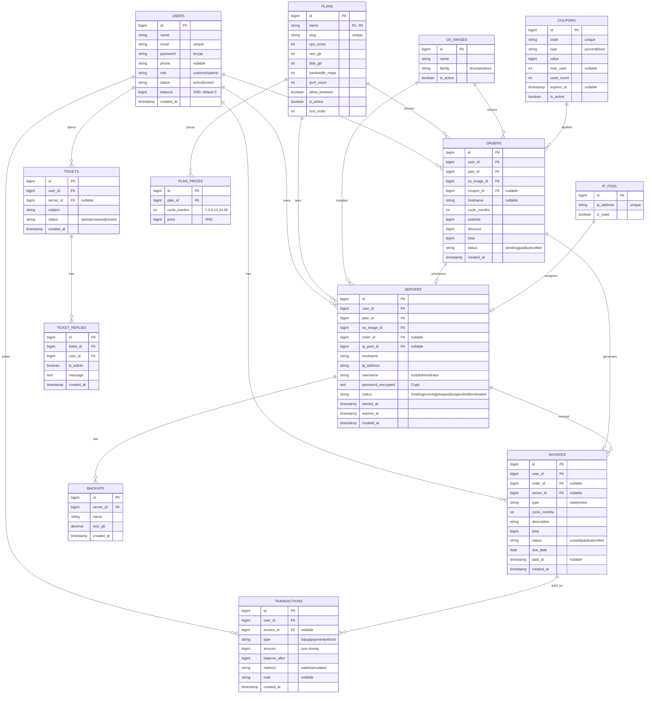
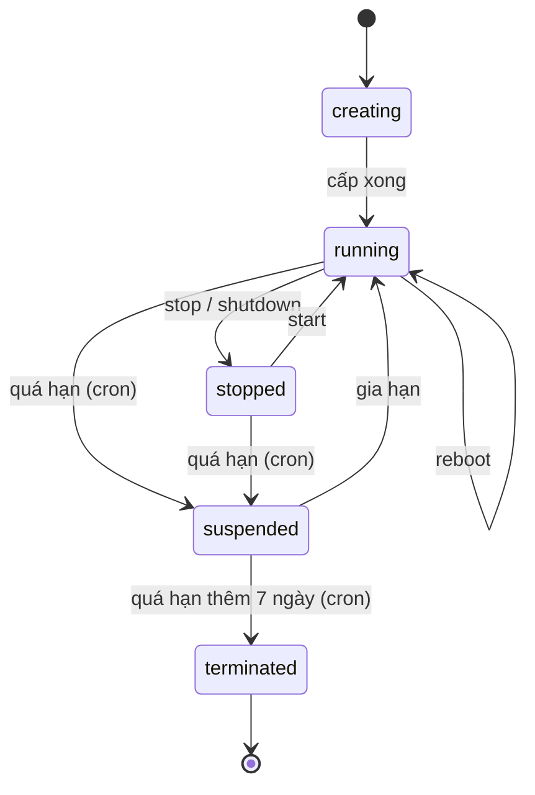
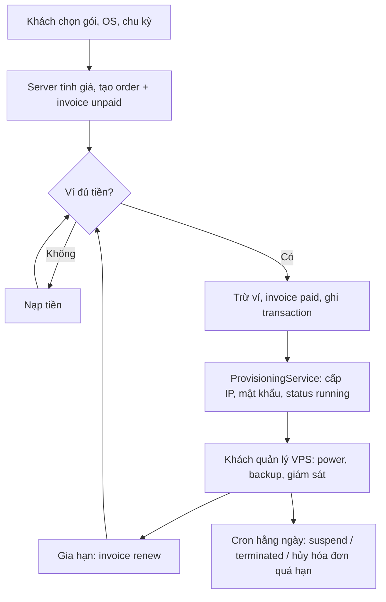

# PROMPT: Xây phần CLIENT cho web cho thuê VPS

> Dán toàn bộ file này cho AI coding (Claude Code, Cursor, Copilot...). Muốn đổi stack thì chỉ sửa mục 2.

---

## 1. Vai trò và mục tiêu

Bạn là senior full-stack developer. Hãy xây **phần client (khách hàng)** của một website cho thuê VPS, mô phỏng theo thuevpsgiare.com. Đây là bài tập cuối kì đại học: ưu tiên **chạy đúng, nghiệp vụ đúng, bảo mật cơ bản đúng**. Giao diện chỉ cần gọn, dùng Bootstrap, không cần đẹp.

Quan trọng:
- **VPS là mô phỏng**: không tạo máy ảo thật. Mọi thứ (IP, trạng thái, giám sát) lưu và sinh trong DB.
- Chỉ làm **client**. Phần **admin làm sau**, nhưng DB phải sẵn sàng cho admin và có sẵn 1 tài khoản admin trong seed.
- Không thêm tính năng ngoài danh sách. Không dùng thư viện lạ khi chưa cần.

## 2. Stack (sửa ở đây nếu muốn đổi)

- Laravel 11, PHP 8.2+, Blade (server-render), MySQL 8
- Bootstrap 5 qua CDN, JavaScript thuần, Chart.js qua CDN (chỉ trang giám sát)
- Tự viết auth bằng `Auth` facade, **không** cài Breeze/Jetstream (tránh kéo Tailwind)
- Tiền tệ: số nguyên VND (`bigint`), không dùng float
- Ngôn ngữ giao diện: tiếng Việt. Tên bảng, cột, biến, route: tiếng Anh

## 3. Cách làm việc (bắt buộc)

1. Làm **theo từng Phase** ở mục 10. Xong mỗi Phase: dừng lại, liệt kê file đã tạo/sửa, ghi cách test tay (URL, tài khoản, bước bấm), rồi **chờ tôi xác nhận** mới sang Phase tiếp.
2. Mỗi Phase phải **chạy được** (migrate, seed, mở trang không lỗi) trước khi báo xong.
3. Nếu yêu cầu mơ hồ, hỏi tối đa 3 câu ngắn rồi làm theo giả định hợp lý nhất, ghi rõ giả định.
4. Không sửa phần đã xong ở Phase trước trừ khi có lỗi, và phải nói rõ sửa gì.
5. Code gọn, đặt tên rõ. Logic nghiệp vụ đặt trong Service class, không nhồi vào Controller/Blade.
6. Cuối cùng viết `README.md`: cài đặt, tạo DB, `php artisan migrate --seed`, tài khoản demo, cách chạy cron.

## 4. Cấu trúc thư mục gợi ý

- `app/Models/*` (có quan hệ Eloquent, `$fillable`, casts)
- `app/Services/`: `PricingService`, `OrderService`, `WalletService`, `InvoiceService`, `ProvisioningService`, `ServerPowerService`, `MonitoringService` (số giả lập)
- `app/Http/Controllers/Client/*`
- `app/Http/Requests/*` (FormRequest cho mọi form)
- `app/Policies/*` (Server, Invoice, Ticket: kiểm tra đúng chủ sở hữu)
- `app/Http/Middleware/EnsureUserIsActive.php`
- `app/Console/Commands/CheckExpiry.php` (lịch chạy hằng ngày)
- `database/migrations`, `database/seeders`
- `resources/views/layouts/app.blade.php`, `resources/views/client/*`

## 5. Database

Dùng migration có khóa ngoại và index. Ghi chú: `string` + enum-like lưu bằng string, kiểm tra ở code (hằng số trong Model).

Quy ước: `transactions` chỉ thêm, không sửa, không xóa (sổ cái). `servers.ip_address` copy từ `ip_pool` để còn hiển thị khi đã trả IP.

### Dữ liệu seed (bắt buộc)

**Gói** (băng thông 100 Mbps, 1 IPv4, tất cả `is_active = true`; chỉ R1 có `allow_windows = false`):

| Gói | CPU | RAM | Ổ NVMe |
|-----|-----|-----|--------|
| R1  | 2   | 2 GB | 30 GB |
| R2  | 2   | 4 GB | 35 GB |
| R3  | 4   | 8 GB | 50 GB |
| R4  | 6   | 12 GB | 80 GB |
| R5  | 8   | 16 GB | 100 GB |

**Giá theo chu kỳ** (đồng, lấy từ trang tham chiếu; mỗi gói chỉ có các chu kỳ sau):

| Gói | 1 tháng | 3 tháng | 6 tháng | 12 tháng | 24 tháng | 36 tháng |
|-----|---------|---------|---------|----------|----------|----------|
| R1 | - | 199.750 | 399.500 | 799.000 | 1.518.000 | 2.157.000 |
| R2 | - | 249.750 | 499.500 | 999.000 | 1.898.000 | 2.697.000 |
| R3 | 208.250 | - | 1.249.500 | 2.499.000 | 4.748.000 | 6.747.000 |
| R4 | 299.917 | - | 1.799.500 | 3.599.000 | 6.838.000 | 9.717.000 |
| R5 | 416.583 | - | 2.499.500 | 4.999.000 | 8.998.000 | 13.497.000 |

Giá "từ X/tháng" ở bảng giá = giá 12 tháng / 12, làm tròn xuống.

**OS**: Ubuntu 22.04, Ubuntu 24.04, Debian 12, AlmaLinux 9 (linux); Windows Server 2019, Windows Server 2022 (windows).
**IP pool**: 50 IP dạng `10.10.0.11` đến `10.10.0.60`.
**Mã giảm giá**: `GIAM10` (10%, không giới hạn), `GIAM50K` (50.000đ cố định, tối đa 20 lượt), `HETHAN` (10%, đã hết hạn, để test).
**User**: `admin@vps.test` / role admin; `khach@vps.test` / customer, ví 1.000.000đ. Mật khẩu demo ghi trong README.

## 6. Quy tắc nghiệp vụ

**Giá và đơn hàng (`PricingService`, `OrderService`)**
- Giá luôn lấy từ `plan_prices` ở server, bỏ qua mọi số tiền gửi lên từ trình duyệt.
- Chỉ cho chọn chu kỳ có trong `plan_prices` của gói đó. Gói không `allow_windows` thì từ chối OS windows (kiểm tra ở server, không chỉ ẩn ở UI).
- Mã giảm giá hợp lệ khi: tồn tại, `is_active`, chưa hết hạn, `used_count < max_uses` (nếu có giới hạn). `percent`: discount = subtotal × value / 100 làm tròn xuống. `fixed`: discount = min(value, subtotal). `total = subtotal - discount`, không âm.
- Tạo đơn: trong **một DB transaction** tạo `order` (pending) + `invoice` (type new, unpaid, `due_date` = hôm nay + 3 ngày). Tăng `used_count` của mã khi tạo đơn; hoàn lại nếu đơn bị hủy.

**Ví và thanh toán (`WalletService`, `InvoiceService`)**
- Nạp tiền (giả lập): cộng `balance`, ghi `transactions` type topup. Số tiền tối thiểu 10.000, tối đa 50.000.000.
- Thanh toán hóa đơn bằng ví, trong **một transaction**, `lockForUpdate` dòng user và dòng invoice:
  1. Nếu invoice không còn `unpaid` thì từ chối (chống bấm 2 lần).
  2. Nếu `balance < total` thì báo thiếu tiền, dẫn sang trang nạp tiền.
  3. Trừ ví, ghi `transactions` type payment (`balance_after` đúng), invoice thành `paid` + `paid_at`.
  4. Gọi hậu xử lý theo loại hóa đơn (new thì cấp VPS, renew thì gia hạn).
- Tuyệt đối không để `balance` âm.

**Cấp VPS (`ProvisioningService`, chỉ gọi khi hóa đơn new được thanh toán)**
- Lấy 1 IP `is_used = false` từ `ip_pool` (khóa dòng khi lấy). Hết IP thì báo lỗi rõ ràng và **không trừ tiền** (kiểm tra IP trước khi trừ, hoặc rollback cả transaction).
- Sinh mật khẩu ngẫu nhiên 16 ký tự, lưu bằng `Crypt::encryptString`. `username` = `root` (linux) hoặc `Administrator` (windows).
- `hostname` = giá trị khách nhập, nếu trống thì `vps-{id}`.
- `started_at` = now, `expires_at` = now + `cycle_months`. Trạng thái đi thẳng `running` (mô phỏng). Order thành `paid`.

**Gia hạn**
- Khách chọn chu kỳ (trong `plan_prices` của gói VPS đó), tạo invoice type renew gắn `server_id`.
- Khi thanh toán: `expires_at` = max(now, `expires_at`) + `cycle_months`. Nếu VPS đang `suspended` thì về `running`. Không gia hạn VPS `terminated`.

**Điều khiển VPS (`ServerPowerService`)** theo sơ đồ trạng thái dưới. Chỉ các hành động hợp lệ ở trạng thái hiện tại mới được chạy, kiểm tra ở server.

| Trạng thái | Hành động cho phép |
|------------|--------------------|
| creating | không có |
| running | reboot, stop, shutdown, reinstall, backup, đổi mật khẩu, gia hạn |
| stopped | start, reinstall, backup, gia hạn |
| suspended | chỉ gia hạn |
| terminated | không có (chỉ xem lịch sử) |

- Reinstall: chọn OS (tuân thủ luật Windows của gói), sinh mật khẩu mới, xóa backup cũ không bắt buộc. Có xác nhận.
- Backup: mỗi VPS tối đa 5 bản. Tạo backup = thêm bản ghi (`size_gb` ngẫu nhiên nhỏ hơn `disk_gb`). Restore = giả lập, hiện thông báo, có xác nhận.
- Giám sát (`MonitoringService`): endpoint JSON trả 24 điểm CPU %, RAM %, mạng Mbps, disk IO. Số sinh **ổn định** từ `server_id` + phút hiện tại (không random thuần túy để biểu đồ không nhảy loạn khi reload). VPS không `running` thì trả 0.

**Cron (`CheckExpiry`, đặt lịch daily)**
- `running`/`stopped` có `expires_at < now` thì chuyển `suspended`.
- `suspended` có `expires_at < now - 7 ngày` thì chuyển `terminated`, trả IP về pool (`is_used = false`, `ip_pool_id = null`).
- Invoice `unpaid` quá `due_date` thì chuyển `cancelled`, order liên quan `cancelled`, hoàn lại `used_count` mã giảm giá.
- "Sắp hết hạn" (còn dưới 7 ngày) tính khi hiển thị, không cần cron.

## 7. Sơ đồ luồng chính

## 8. Route và trang (client)

| Route | Trang | Quyền |
|-------|-------|-------|
| `GET /` | Trang chủ (banner, ưu điểm, nút xem bảng giá) | guest |
| `GET /pricing` | Bảng giá: card 5 gói, giá "từ X/tháng", nút Đăng ký ngay | guest |
| `GET/POST /register` | Đăng ký | guest |
| `GET/POST /login`, `POST /logout` | Đăng nhập (throttle 5 lần/phút), đăng xuất | guest/auth |
| `GET /order?plan={slug}` | Đặt hàng: chọn gói, OS, chu kỳ, hostname, mã giảm giá, tóm tắt giá cập nhật khi đổi lựa chọn (JS gọi `GET /order/quote`, server trả giá) | auth |
| `POST /order` | Tạo order + invoice, chuyển sang chi tiết hóa đơn | auth |
| `GET /invoices` | Danh sách hóa đơn, lọc theo trạng thái, phân trang | auth |
| `GET /invoices/{id}` | Chi tiết + nút "Thanh toán bằng ví" | auth + owner |
| `POST /invoices/{id}/pay` | Thanh toán | auth + owner |
| `GET/POST /wallet` | Số dư, form nạp tiền, lịch sử giao dịch (phân trang) | auth |
| `GET /services` | Dịch vụ của tôi: hostname, gói, IP, OS, trạng thái, hạn; đánh dấu sắp hết hạn | auth |
| `GET /services/{id}` | Chi tiết VPS: thông tin, nút điều khiển theo trạng thái, mật khẩu (che, có nút hiện), giám sát, backup | auth + owner |
| `POST /services/{id}/power` | Tham số `action`: start, reboot, stop, shutdown | auth + owner |
| `POST /services/{id}/reinstall` | Cài lại OS | auth + owner |
| `POST /services/{id}/backups`, `POST /services/{id}/backups/{b}/restore` | Tạo, khôi phục backup | auth + owner |
| `GET /services/{id}/metrics` | JSON giám sát cho Chart.js | auth + owner |
| `GET/POST /services/{id}/renew` | Chọn chu kỳ, tạo hóa đơn gia hạn | auth + owner |
| `GET/POST /tickets`, `GET /tickets/{id}`, `POST /tickets/{id}/reply`, `POST /tickets/{id}/close` | Ticket | auth + owner |
| `GET/POST /profile`, `POST /profile/password` | Sửa họ tên, SĐT; đổi mật khẩu (nhập pass cũ) | auth |

Layout chung: header đổi theo trạng thái đăng nhập (hiện số dư ví khi đã login), vùng flash message dùng chung, trang 403/404 riêng.

## 9. Bảo mật và chất lượng (bắt buộc)

- Mọi route sau đăng nhập có middleware `auth` + `EnsureUserIsActive` (user `locked` bị đăng xuất và báo rõ).
- Kiểm tra chủ sở hữu bằng **Policy** ở server cho server, invoice, ticket. Truy cập đồ của người khác trả 403.
- CSRF trên mọi form POST. Blade chỉ dùng `{{ }}` (tự escape), không dùng `{!! !!}` với dữ liệu người dùng.
- Mọi input qua FormRequest validate. Mật khẩu tối thiểu 8 ký tự, hash bcrypt, `session()->regenerate()` sau login.
- Không dùng raw SQL ghép chuỗi với input. Đặt `$fillable` chặt, không mass-assign `role`, `balance`.
- Thông báo đăng nhập sai chung chung. Không log mật khẩu VPS. Không commit `.env`, có `.env.example`.
- Mọi thao tác thay đổi tiền hoặc trạng thái nằm trong DB transaction.
- Hành động nguy hiểm (stop, shutdown, reinstall, restore) có hộp xác nhận.
- Mọi danh sách dài có phân trang.

## 10. Các Phase (làm tuần tự, dừng chờ xác nhận)

**Phase 0: Khởi tạo.** Project Laravel, cấu hình MySQL, layout Bootstrap, flash message, trang 403/404.
Xong khi: mở được trang trống có header/footer.

**Phase 1: Database.** Migration, Model + quan hệ, seeder đúng mục 5.
Xong khi: `php artisan migrate:fresh --seed` chạy sạch, dữ liệu đúng bảng giá.

**Phase 2: Auth.** Đăng ký, đăng nhập (throttle), đăng xuất, middleware active, hồ sơ + đổi mật khẩu.
Xong khi: đăng ký, đăng nhập, user locked bị chặn, email trùng báo lỗi.

**Phase 3: Trang công khai.** Trang chủ, bảng giá lấy từ DB (chỉ gói active).
Xong khi: giá "từ X/tháng" đúng bằng giá 12 tháng chia 12.

**Phase 4: Đặt hàng.** Trang order, endpoint `quote`, tạo order + invoice.
Xong khi: R1 không chọn được Windows, mã `HETHAN` bị từ chối, giá server tính khớp bảng seed, chưa đăng nhập bị đưa đi login rồi quay lại đúng bước.

**Phase 5: Hóa đơn, ví, cấp VPS.** Danh sách + chi tiết hóa đơn, nạp tiền, thanh toán, `ProvisioningService`.
Xong khi: thiếu tiền thì không trừ, đủ tiền thì VPS xuất hiện đúng IP, bấm thanh toán 2 lần chỉ trừ 1 lần, transaction có `balance_after` đúng.

**Phase 6: Quản lý VPS.** Danh sách, chi tiết, power theo trạng thái, reinstall, backup, giám sát bằng Chart.js.
Xong khi: nút hiện/ẩn đúng bảng trạng thái, gọi thẳng POST sai trạng thái bị từ chối, user khác vào VPS của mình bị 403.

**Phase 7: Gia hạn.** Hóa đơn renew, cộng hạn đúng, VPS suspended về running.
Xong khi: gia hạn VPS còn hạn thì cộng dồn, VPS đã hết hạn thì tính từ hôm nay.

**Phase 8: Ticket.** Tạo, xem, trả lời, đóng.
Xong khi: ticket của người khác không xem được.

**Phase 9: Cron + hoàn thiện.** Lệnh `CheckExpiry` + schedule, rà bảo mật mục 9, README, danh sách test tay.
Xong khi: chỉnh `expires_at` lùi trong DB rồi chạy lệnh thì trạng thái chuyển đúng, IP được trả khi terminated.

## 11. Checklist nghiệm thu cuối

- [ ] Đăng ký, đăng nhập, đăng xuất, đổi mật khẩu
- [ ] Đặt hàng đủ 5 gói, kiểm tra luật Windows và chu kỳ từng gói
- [ ] Mã giảm giá đúng, sai, hết hạn
- [ ] Thiếu tiền, đủ tiền, bấm thanh toán 2 lần
- [ ] VPS được cấp, mật khẩu hiện được và đăng nhập thông tin đúng
- [ ] Start/Reboot/Stop/Shutdown đúng theo trạng thái
- [ ] Reinstall, backup (tối đa 5), restore
- [ ] Gia hạn VPS còn hạn và đã hết hạn
- [ ] Cron suspend, terminated, trả IP, hủy hóa đơn quá hạn
- [ ] Truy cập chéo dữ liệu người khác đều 403
- [ ] Ticket tạo, trả lời, đóng
- [ ] Phân trang các danh sách dài, thông báo thành công/lỗi rõ ràng
